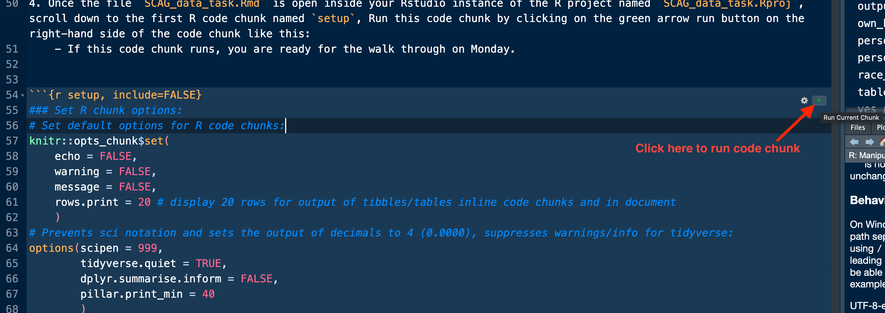

# Setup and Initial Instructions:

1. If this is the first time running this script, first update `R` and `Rstudio` (these are separate installations):
    - Follow the two steps at this [link](https://posit.co/download/rstudio-desktop/), be sure to select the versions of `R` and `Rstudio` that match your computer's operating system.
2. Open/De-compress the `SCAG_data_task.zip`, open the folder "/SCAG_data_task", here are the folders and files that it will contain and below is a directory tree to show the full structure: 
    - `SCAG_data_task.Rmd` is the main file that contains all the R code to download, clean produce the
    - `SCAG_data_task.Rproj` is an R project file that is necessary to reproduce the file paths for all the code, used with R package `here`. Double clicking on this file will launch `Rstudio` as this R project.
    - `SCAG_data_task.html` is the walk through documentation that contains these instructions and all of the commentary inside this file `SCAG_data_task.Rmd` that is outside R code chunks.
    - The "/data" folder contains all of the raw ACS PUMS data both for the 5 year estimates of 2021 and 2022.
    - `data_cleaning_ACS.R` is a reference code for the data cleaning/new variable creation that takes place later in this file `SCAG_data_task.Rmd`.
    - The "/data_dictionaries" folder contains data dictionaries for reference both for the 5 year estimates of 2021 (`pums_vars_acs5_2021.csv`) and 2022 (`pums_vars_acs5_2022.csv`) and for new variables created for this analysis (`ACS_data_new_vars_tbl.csv`).
    - `style.css` is styling for the html output of `SCAG_data_task.html` (not necessary to know what this is).
    - "/images" folder contains screenshots for reference.
    
Directory Tree Diagram for folder "SCAG_data_task": 
```{r, echo=FALSE}
fs::dir_tree(path = ".")
```

3. Once you have opened and inspected the the folder "/SCAG_data_task", Open the R project file named `SCAG_data_task.Rproj` by double-clicking on it, this will launch your Rstudio as an R project, then open the `SCAG_data_task.Rmd` by going to File, Open, click on R markdown file `SCAG_data_task.Rmd` inside folder 'SCAG_data_task'. R markdown files are like R scripts that allow for adding text in between R code which is contained inside code chunks like this: 

4. Once the file `SCAG_data_task.Rmd` is open inside your Rstudio instance of the R project named `SCAG_data_task.Rproj`, scroll down to the first R code chunk named `setup` (code line # 40), Run this code chunk by clicking on the green arrow run button on the right-hand side of the code chunk like this: 
    - If this code chunk runs, you are ready for the walk through on Monday.

```{r setup, include=FALSE}
### Set R chunk options:
# Set default options for R code chunks:
knitr::opts_chunk$set(
    echo = FALSE, 
    warning = FALSE, 
    message = FALSE,
    rows.print = 20 # display 20 rows for output of tibbles/tables inline code chunks and in document
    )
# Prevents sci notation and sets the output of decimals to 4 (0.0000), suppresses warnings/info for tidyverse:
options(scipen = 999,
        tidyverse.quiet = TRUE,
        dplyr.summarise.inform = FALSE,
        pillar.print_min = 40
        )

# First install the package named "remotes", if it is not already installed in order to use the next line (remotes::update_packages()):
if (!require("remotes")) {install.packages("remotes")}
# The function remotes::update_packages() will install a package if not installed and then if it is installed it will update the packages, if updates exist.
remotes::update_packages(c("here", "rstudioapi", "magrittr", "curl", "fs", "tools", "knitr", "spatstat", "openxlsx2", "data.table", "tidycensus", "tidyverse")) 

# Set here() location- Working directory (root for all relative paths) will then be based on the project folder of the current file:
here::i_am(basename(rstudioapi::getSourceEditorContext()$path))

### Load libraries:
library(here) # package to manage file paths
library(magrittr) # pipe function package
library(openxlsx2) # writing excel files and manipulating excel workbooks.
library(data.table) # package for data manipulation and reads in large files faster using fread()
library(tidyverse) # package loads all tidyverse packages like dplyr, tidyselect, stringR, etc.

### Functions ----
### weight_perc_table()
# Function to return full table of weighted percentages by group and filtered to one value of a variable: weight_perc_table()
# For use when you want to return weighted percentages of one value of a variable and by one group- e.g. people with disability (%) by county
# df = dataframe of all data, var = variable to sum over,  weight = weights, group = grouping variable, filter_value = value of a variable to filter output to, NULL by default, and 
# group_label_totals = "SCAG" - this is the label for the group total of the grouped variable, defaults to "SCAG".
weight_perc_table <- function(df, var, weight, group, filter_value = NULL, group_label_totals = "SCAG") {
    # If filter_value is not NULL:
    if (!is.null(filter_value)) {
    # Get var percentages for all:
    overall_perc <- df %>% select({{weight}}, {{var}})  %>% count(!!sym((var)), wt = !!sym((weight))) %>% mutate(total_pop = sum(n)) %>% 
                                            group_by(!!sym((var))) %>% summarize(percentage = round( (n / total_pop)*100, 2)) %>% filter(!!sym((var)) == filter_value) %>% ungroup() %>% 
                                            mutate({{group}} := group_label_totals) %>% select({{group}}, percentage)
                                            

    # Get var percentages for by group:
    group_perc <- df %>% select({{weight}}, {{var}}, {{group}}) %>% group_by(!!sym((group))) %>% count(!!sym((var)), wt = !!sym((weight))) %>% mutate(total_pop = sum(n)) %>% 
                                            group_by(!!sym((var)), !!sym((group))) %>% summarize(percentage = round( (n / total_pop)*100, 2)) %>% filter(!!sym((var)) == filter_value) %>% ungroup() %>% 
                                             select({{group}}, percentage)

    # Full join group_perc and overall_perc by group, percentage and re-order the columns:
    full_table <- full_join(group_perc, overall_perc, by = join_by({{group}}, percentage)) %>% 
                     select({{group}}, percentage)

    return(full_table)
    
    } else { # else filter_value is NULL:
        
    # Get var percentages for all:
    overall_perc <- df %>% select({{weight}}, {{var}})  %>% count(!!sym((var)), wt = !!sym((weight))) %>% mutate(total_pop = sum(n)) %>% 
                                            group_by(!!sym((var))) %>% summarize(percentage = round( (n / total_pop)*100, 2)) %>% ungroup() %>% 
                                            mutate({{group}} := group_label_totals) %>% select({{var}}, {{group}}, percentage)
                                            

    # Get var percentages for by group:
    group_perc <- df %>% select({{weight}}, {{var}}, {{group}}) %>% group_by(!!sym((group))) %>% count(!!sym((var)), wt = !!sym((weight))) %>% mutate(total_pop = sum(n)) %>% 
                                            group_by(!!sym((var)), !!sym((group))) %>% summarize(percentage = round( (n / total_pop)*100, 2)) %>% ungroup() %>% 
                                             select({{var}}, {{group}}, percentage)

    # Full join group_perc and overall_perc by var, group, percentage and re-order the columns:
    full_table <- full_join(group_perc, overall_perc, by = join_by({{var}}, {{group}}, percentage)) %>% 
                    select({{group}}, {{var}}, percentage)

    return(full_table)
    }
}

### 
### weight_perc_2groups() 
# Function to return full table of weighted percentages by two groups and also able to be filtered to one value of a variable if specified: weight_perc_2groups()
# # For use when you want to return weighted percentages by two groups- e.g. HH without a vehicle (%) by county and race.
# df = dataframe of all data, var = variable to sum over,  weight = weights, group1 = grouping variable 1 (county), group2 = grouping variable 2 (race),
#  filter_value = value of a variable to filter output to, group1_levels = levels (vector) to change group1 to a factor, group2_levels = levels to change group2 to a factor
# has and if statement to drop filter_value if NULL, which it is by default group_by(across(variables_2)), group1_label_totals = "SCAG" - this is the label for the group1 total of the grouped variable, defaults to "SCAG", group2_label_totals = "All Races" - this is the label for the group1 total of the grouped variable, defaults to "All Races". IMPORTANT if you change group1_label_totals or group2_label_totals, then respective group1_levels and group2_levels need to be changed to match total label.
weight_perc_2groups <- function(df, var, weight, group1, group2, filter_value = NULL, group1_levels = NULL, group2_levels = NULL, group1_label_totals = "SCAG", group2_label_totals = "All Races") {
    # If filter_value is not NULL:
    if (!is.null(filter_value)) {
    # Get percent for group1 (usually county):
    group1_total <-  df %>% select({{weight}}, {{var}}, {{group1}}) %>% group_by(!!sym((group1))) %>% count(!!sym((var)), wt = !!sym((weight))) %>% mutate(total_pop = sum(n)) %>% 
                                                group_by(!!sym((var)), !!sym((group1))) %>% summarize(percentage = round( (n / total_pop)*100, 2)) %>% 
                                                filter(!!sym((var)) == filter_value) %>% ungroup() %>% mutate({{group2}} := group2_label_totals) %>% select({{group1}}, {{group2}},  percentage)

    # Get percent for group2 (usually county):
    group2_total <-  df %>% select({{weight}}, {{var}}, {{group2}}) %>% group_by(!!sym((group2))) %>% count(!!sym((var)), wt = !!sym((weight))) %>% mutate(total_pop = sum(n)) %>% 
                                                group_by(!!sym((var)), !!sym((group2))) %>% summarize(percentage = round( (n / total_pop)*100, 2)) %>% 
                                                filter(!!sym((var)) == filter_value) %>% ungroup() %>% mutate({{group1}} := group1_label_totals) %>% select({{group1}}, {{group2}},  percentage)

    # Get percent for group2 (usually county):
    group1_by_group2_total <-  df %>% select({{weight}}, {{var}}, {{group1}}, {{group2}}) %>% group_by(!!sym((group1)), !!sym((group2))) %>% 
                                              count(!!sym((var)), wt = !!sym((weight))) %>% mutate(total_pop = sum(n)) %>% 
                                                group_by(!!sym((var)), !!sym((group1)), !!sym((group2))) %>% summarize(percentage = round( (n / total_pop)*100, 2)) %>% 
                                                filter(!!sym((var)) == filter_value) %>% ungroup() %>% 
                                                 select({{group1}}, {{group2}},  percentage)

    # Get percent for group2 (usually county):
    total_overall <-  df %>% select({{weight}}, {{var}}) %>% count(!!sym((var)), wt = !!sym((weight))) %>% mutate(total_pop = sum(n)) %>% 
                                              group_by(!!sym((var))) %>%  summarize(percentage = round( (n / total_pop)*100, 2)) %>% 
                                                filter(!!sym((var)) == filter_value) %>% ungroup() %>%  mutate({{group1}} := group1_label_totals) %>% 
                                                 select({{group1}}, percentage)

    # Full join two total tables- group1_total and total_overall- then create a group2_label_totals for column group2:
    group1_total_overall_tbl <- full_join(group1_total, total_overall, by = join_by({{group1}}, percentage)) %>% mutate({{group2}} := group2_label_totals)

    # Full join group1_by_group2_total and group1_total_overall_tbl tables, then full_join join group2_total, re-order columns = {{group1}}, {{group2}}, percentage:
    full_table <- full_join(group1_by_group2_total,group1_total_overall_tbl, by = join_by({{group1}}, {{group2}}, percentage)) %>% 
                        full_join(.,group2_total, by = join_by({{group1}}, {{group2}}, percentage)) %>% 
                            select({{group1}}, {{group2}}, percentage)
        
        # If both group1_levels and group2_levels are NOT NULL:
        if (!is.null(group1_levels) & !is.null(group2_levels)) {
            
        # If levels are provided for both group1_levels and group2_levels- set each as a factor with levels and then arrange by group1,group2:
        full_table <- full_table %>% mutate({{group1}} := factor(!!sym((group1)), levels = group1_levels),
                                            {{group2}} := factor(!!sym((group2)), levels = group2_levels)) %>% 
                                     arrange(!!sym((group1)),!!sym((group2))) %>% 
                                     select({{group1}}, {{group2}}, percentage)
        } 
    
    } else { # else filter_value is NULL:
        
    # Get percent for group1 (usually county):
    group1_total <-  df %>% select({{weight}}, {{var}}, {{group1}}) %>% group_by(!!sym((group1))) %>% count(!!sym((var)), wt = !!sym((weight))) %>% mutate(total_pop = sum(n)) %>% 
                                                group_by(!!sym((var)), !!sym((group1))) %>% summarize(percentage = round( (n / total_pop)*100, 2)) %>% ungroup() %>% 
                                                mutate({{group2}} := group2_label_totals) %>% select({{var}}, {{group1}}, {{group2}},  percentage)

    # Get percent for group2 (usually county):
    group2_total <-  df %>% select({{weight}}, {{var}}, {{group2}}) %>% group_by(!!sym((group2))) %>% count(!!sym((var)), wt = !!sym((weight))) %>% mutate(total_pop = sum(n)) %>% 
                                                group_by(!!sym((var)), !!sym((group2))) %>% summarize(percentage = round( (n / total_pop)*100, 2)) %>% ungroup() %>% 
                                                mutate({{group1}} := group1_label_totals) %>% select({{var}}, {{group1}}, {{group2}},  percentage)

    # Get percent for group2 (usually county):
    group1_by_group2_total <-  df %>% select({{weight}}, {{var}}, {{group1}}, {{group2}}) %>% group_by(!!sym((group1)), !!sym((group2))) %>% 
                                              count(!!sym((var)), wt = !!sym((weight))) %>% mutate(total_pop = sum(n)) %>% 
                                                group_by(!!sym((var)), !!sym((group1)), !!sym((group2))) %>% 
                                                summarize(percentage = round( (n / total_pop)*100, 2)) %>% ungroup() %>% 
                                                 select({{var}}, {{group1}}, {{group2}},  percentage)

    # Get percent for group2 (usually county):
    total_overall <-  df %>% select({{weight}}, {{var}}) %>% count(!!sym((var)), wt = !!sym((weight))) %>% mutate(total_pop = sum(n)) %>% 
                                              group_by(!!sym((var))) %>%  summarize(percentage = round( (n / total_pop)*100, 2)) %>% ungroup() %>%  
                                                mutate({{group1}} := group1_label_totals) %>% select({{var}}, {{group1}}, percentage)

    # Full join two total tables- group1_total and total_overall- then create a group2_label_totals for column group2:
    group1_total_overall_tbl <- full_join(group1_total, total_overall, by = join_by({{var}}, {{group1}}, percentage)) %>% mutate({{group2}} := group2_label_totals)

    # Full join group1_by_group2_total and group1_total_overall_tbl tables, then full_join join group2_total, re-order columns = {{group1}}, {{group2}}, percentage:
    full_table <- full_join(group1_by_group2_total,group1_total_overall_tbl, by = join_by({{var}}, {{group1}}, {{group2}}, percentage)) %>% 
                        full_join(.,group2_total, by = join_by({{var}}, {{group1}}, {{group2}}, percentage)) %>% 
                            select({{group1}}, {{group2}}, {{var}}, percentage)
        
        # If both group1_levels and group2_levels are NOT NULL:
        if (!is.null(group1_levels) & !is.null(group2_levels)) {
            
        # If levels are provided for both group1_levels and group2_levels- set each as a factor with levels and then arrange by group1,group2:
        full_table <- full_table %>% mutate({{group1}} := factor(!!sym((group1)), levels = group1_levels),
                                            {{group2}} := factor(!!sym((group2)), levels = group2_levels)) %>% 
                                     arrange(!!sym((group1)), !!sym((var)), !!sym((group1))) %>% 
                                     select({{group1}}, {{group2}}, {{var}}, percentage)
        } 
    
    } # End of main if/else.
    
    
    return(full_table)
} # end of weight_perc_2groups()

### Create directories and setup file paths ----
# Creates a new folder called "data" if it doesn't already exist in working directory:
if (!dir.exists("data")) {dir.create("data")}
# Set up all file paths:
# file path for all raw data:
data_fp <- here('data')
# list.files(data_fp)

### IMPORTS directories and filepaths 
# Creates a new folder called "data/2017_2021_ACS_PUMS" if it doesn't already exist in working directory:
if (!dir.exists(here(data_fp, '2017_2021_ACS_PUMS'))) {dir.create(here(data_fp, '2017_2021_ACS_PUMS'))}
# file path for 2021 5-year ACS PUMS Data:
acs_2021_fp <- here(data_fp, '2017_2021_ACS_PUMS')

# Creates a new folder called "data/2018_2022_ACS_PUMS" if it doesn't already exist in working directory:
if (!dir.exists(here(data_fp, '2018_2022_ACS_PUMS'))) {dir.create(here(data_fp, '2018_2022_ACS_PUMS'))}
# Set up file path for 2022 5-year ACS PUMS Data:
acs_2022_fp <- here(data_fp, '2018_2022_ACS_PUMS')

# Set up filepaths for all ACS raw data from FTP download:
# file path for 2021 household level data
hh_2021_fp <- here(acs_2021_fp,  "housing_CA_ACS_2021.csv")
# file path for 2021 person level data
person_2021_fp <- here(acs_2021_fp, "person_CA_ACS_2021.csv")

# file path for 2021 household level data
hh_2022_fp <- here(acs_2022_fp,  "housing_CA_ACS_2022.csv")
# file path for 2021 person level data
person_2022_fp <- here(acs_2022_fp, "person_CA_ACS_2022.csv")

### CLEAN DATA directories and filepaths
# File paths and directories for clean data- 
# Creates a new folder called "clean_data" if it doesn't already exist in working directory:
if (!dir.exists("clean_data")) {dir.create("clean_data")}
# file path for clean_data
clean_data_fp <- here("clean_data")
# list.files(clean_data_fp)

# Clean 21 data
# Creates a new folder called "acs_data_21" (if it doesn't already exist in working directory)- this will be where the clean data for the 2021 ACS will be stored:
if (!dir.exists(here(clean_data_fp, "acs_data_21"))) {dir.create(here(clean_data_fp, "acs_data_21"))}
# file path for clean_data acs_data_21
acs_data_21_fp <- here(clean_data_fp, "acs_data_21")

# Clean 22 data
# Creates a new folder called "acs_data_22" (if it doesn't already exist in working directory)- this will be where the clean data for the 2022 ACS will be stored:
if (!dir.exists(here(clean_data_fp, 'acs_data_22'))) {dir.create(here(clean_data_fp, 'acs_data_22'))}
# file path for clean_data acs_data_22
acs_data_22_fp <- here(clean_data_fp, "acs_data_22")

### OUTPUT directories and filepaths
# output folder
# Creates a new folder called "output" (if it doesn't already exist in working directory)- this will be where the outputs from the R script will be stored:
if (!dir.exists(here('output'))) {dir.create(here('output'))}
# file path for clean_data acs_data_22
output_fp <- here("output")

# Creates a new folder called "acs_api" (if it doesn't already exist in working directory)- this will be where the individual tables for 
# the tabbed output from the R script will be stored as separate .csv's:
if (!dir.exists(here(output_fp, 'tables'))) {dir.create(here(output_fp, 'tables'))}
# file path for clean_data acs_data_22
tables_fp <- here(output_fp, 'tables')

### data_dictionaries directories and filepaths
# Creates a new folder called "data_dictionaries" (if it doesn't already exist in working directory)- this will be where the outputs from the R script will be stored:
if (!dir.exists(here('data_dictionaries'))) {dir.create(here('data_dictionaries'))}
# file path for clean_data acs_data_22
data_dictionaries_fp <- here("data_dictionaries")

# Return a file tree of current path: fs::dir_tree(path = ".")

### Un-comment for new 2023 data (all filepaths that will be for 2023 data): ----
# # Creates a new folder called "data/2019_2023_ACS_PUMS" if it doesn't already exist in working directory:
# if (!dir.exists(here(data_fp, '2019_2023_ACS_PUMS'))) {dir.create(here(data_fp, '2019_2023_ACS_PUMS'))}
# # Set up file path for 2022 5-year ACS PUMS Data:
# acs_2023_fp <- here(data_fp, '2019_2023_ACS_PUMS')
# 
# # Set up filepaths for all ACS raw data from FTP download:
# # file path for 2023 household level data
# hh_2023_fp <- here(acs_2023_fp,  "housing_CA_ACS_2021.csv")
# # file path for 2023 person level data
# person_2023_fp <- here(acs_2023_fp, "person_CA_ACS_2021.csv")
# 
# # Clean 23 data
# # Creates a new folder called "acs_data_23" (if it doesn't already exist in working directory)- this will be where the clean data for the 2023 ACS will be stored:
# if (!dir.exists(here(clean_data_fp, 'acs_data_23'))) {dir.create(here(clean_data_fp, 'acs_data_23'))}
# # file path for clean_data acs_data_23
# acs_data_23_fp <- here(clean_data_fp, "acs_data_23")
```


# Download, Read in, and Clean data from US Census ACS PUMS

### Download data from US Census American Community Survey (ACS) Public Use Microdata Sample (PUMS) File Transfer Protocol (FTP) site:

- The first step is retrieving the .csv files that make up both 5 year estimates from 2017-2021 and 2018-2022.
- The next code chunk will download each of the zip files for the housing and person level data, both for the 5 year estimates from 2017-2021 and 2018-2022. 
- This code can be changed to retrieve the 2023 data once it is released in 2025.
- These files are located on the US Census American Community Survey (ACS) Public Use Microdata Sample (PUMS) [File Transfer Protocol (FTP) site](https://www2.census.gov/programs-surveys/acs/data/pums/2021/5-Year/)
- Links for 2017-2021 files:
    - Housing 2017-2021 PUMS .csv data link (clicking link will download the full large file): https://www2.census.gov/programs-surveys/acs/data/pums/2021/5-Year/csv_hca.zip
    - Person 2017-2021 PUMS .csv data link (clicking link will download the full large file): https://www2.census.gov/programs-surveys/acs/data/pums/2021/5-Year/csv_pca.zip
- Links for 2018-2022 files: 
    - Housing 2018-2022 PUMS .csv data link (clicking link will download the full large file): https://www2.census.gov/programs-surveys/acs/data/pums/2022/5-Year/csv_hca.zip
    - Person 2018-2022 PUMS .csv data link (clicking link will download the full large file): https://www2.census.gov/programs-surveys/acs/data/pums/2022/5-Year/csv_pca.zip
- To get the URL's for the desired .zip files, go to the FTP site, click on the desired year for the 5-year estimates.
    - The file name convention is `{file type}_{h=housing/p=person}{state abbreviation}.zip`, e.g. `csv_hca.zip` is a .csv file, for housing level data for the state of California (CA).
    - Right click on the .zip file and click "Copy Link Address".  
- This process takes about 5 minutes to download all files depending on your internet connection and can be skipped if you have the full .zip drive with the data files already downloaded.

```{r acs_data_dwnld, include=FALSE}
### 2017-2021 ACS PUMS DATA Download Housing and Person level files
# Housing- Link for Housing csv file for California as a zip file: (clicking link/visiting it will download the zip file to where default downloads for your browser) https://www2.census.gov/programs-surveys/acs/data/pums/2021/5-Year/csv_hca.zip
# 2021 Housing .csv file, destfile is where the file will be downloaded and its name/extension, download to "data/2017_2021_ACS_PUMS/csv_hca.zip" or use here(acs_2021_fp, "csv_hca.zip"),
# if the .zip file does NOT exist in the "data/2017_2021_ACS_PUMS" folder, then it will be downloaded it:
if (!file.exists(here(acs_2021_fp, "csv_hca.zip"))) {
    curl::curl_download("http://www2.census.gov/programs-surveys/acs/data/pums/2021/5-Year/csv_hca.zip", destfile = here(acs_2021_fp, "csv_hca.zip"))
    }
# Decompress/unzip "csv_hca.zip" and save in same folder "data/2017_2021_ACS_PUMS" or acs_2021_fp
unzip(zipfile = here(acs_2021_fp, "csv_hca.zip"), exdir = acs_2021_fp, overwrite = TRUE)
# Person- Link for Person csv file for California as a zip file:  https://www2.census.gov/programs-surveys/acs/data/pums/2021/5-Year/csv_pca.zip
# 2021 Person .csv file, destfile is where the file will be downloaded and its name/extension, download to "data/2017_2021_ACS_PUMS/csv_pca.zip" or use here(acs_2021_fp, "csv_pca.zip"),
# if the .zip file does NOT exist in the "data/2017_2021_ACS_PUMS" folder, then it will be downloaded it:
if (!file.exists(here(acs_2021_fp, "csv_pca.zip"))) {
curl::curl_download("http://www2.census.gov/programs-surveys/acs/data/pums/2021/5-Year/csv_pca.zip", destfile = here(acs_2021_fp, "csv_pca.zip"))
    }
# Decompress/unzip "csv_hca.zip" and save in same folder "data/2017_2021_ACS_PUMS/" or acs_2021_fp
unzip(zipfile = here(acs_2021_fp, "csv_pca.zip"), exdir = acs_2021_fp, overwrite = TRUE)

### 2018-2022 ACS PUMS DATA Download Housing and Person level files:
# Housing- Link for Housing csv file for California as a zip file: (clicking link/visiting it will download the zip file to where default downloads for your browser) https://www2.census.gov/programs-surveys/acs/data/pums/2022/5-Year/csv_hca.zip
# 2022 Housing .csv file, destfile is where the file will be downloaded and its name/extension, download to "data/2018_2022_ACS_PUMS/csv_hca.zip" or use here(acs_2022_fp, "csv_hca.zip"):
# if the .zip file does NOT exist in the "data/2017_2021_ACS_PUMS" folder, then it will be downloaded it:
if (!file.exists(here(acs_2022_fp, "csv_hca.zip"))) {
curl::curl_download("http://www2.census.gov/programs-surveys/acs/data/pums/2022/5-Year/csv_hca.zip", destfile = here(acs_2022_fp, "csv_hca.zip"))
    }
# Decompress/unzip "csv_hca.zip" and save in same folder "data/2018_2022_ACS_PUMS/" or acs_2022_fp
unzip(zipfile = here(acs_2022_fp, "csv_hca.zip"), exdir = acs_2022_fp, overwrite = TRUE)

# Person- Link for Person csv file for California as a zip file:  https://www2.census.gov/programs-surveys/acs/data/pums/2022/5-Year/csv_pca.zip
# 2022 Person .csv file, destfile is where the file will be downloaded and its name/extension, download to "data/2018_2022_ACS_PUMS/csv_pca.zip" or use here(acs_2022_fp, "csv_pca.zip"):
# if the .zip file does NOT exist in the "data/2017_2021_ACS_PUMS" folder, then it will be downloaded it:
if (!file.exists(here(acs_2022_fp, "csv_pca.zip"))) {
curl::curl_download("http://www2.census.gov/programs-surveys/acs/data/pums/2022/5-Year/csv_pca.zip", destfile = here(acs_2022_fp, "csv_pca.zip"))
    }
# Decompress/unzip "csv_hca.zip" and save in same folder "data/2018_2022_ACS_PUMS/" or acs_2022_fp
unzip(zipfile = here(acs_2022_fp, "csv_pca.zip"), exdir = acs_2022_fp, overwrite = TRUE)

# Delete all zip files after extracting from 2021 and 2022 folders:
# file.remove(here(acs_2021_fp, list.files(here(acs_2021_fp), pattern = "*.zip"))) %>% invisible()
# file.remove(here(acs_2022_fp, list.files(here(acs_2022_fp), pattern = "*.zip"))) %>% invisible()

# Use file.rename() function to rename both 2021 files and 2022 files, using filepaths set up in the setup code chunk(lines 273-282):
# 2021 rename .csv's: 
file.rename(here(acs_2021_fp, "psam_h06.csv"), hh_2021_fp) %>% invisible()
file.rename(here(acs_2021_fp, "psam_p06.csv"), person_2021_fp) %>% invisible()
# 2022 rename .csv's:
file.rename(here(acs_2022_fp, "psam_h06.csv"), hh_2022_fp) %>% invisible()
file.rename(here(acs_2022_fp, "psam_p06.csv"), person_2022_fp) %>% invisible()

### Un-comment for new 2023 data (data download for new 2023 5-year ACS-PUMS data): ----
### 2019-2023 ACS PUMS DATA Download Housing and Person level files:
# # 2023 Housing .csv file, destfile is where the file will be downloaded and its name/extension, download to "data/2018_2023_ACS_PUMS/csv_hca.zip" or use here(acs_2023_fp, "csv_hca.zip"):
# if (!file.exists(here(acs_2023_fp, "csv_hca.zip"))) {
# curl::curl_download("http://www2.census.gov/programs-surveys/acs/data/pums/2023/5-Year/csv_hca.zip", destfile = here(acs_2023_fp, "csv_hca.zip"))
#     }
# # Decompress/unzip "csv_hca.zip" and save in same folder "data/2018_2023_ACS_PUMS/" or acs_2023_fp
# unzip(zipfile = here(acs_2023_fp, "csv_hca.zip"), exdir = acs_2023_fp, overwrite = TRUE)
# 
# # Person- Link for Person csv file for California as a zip file:  https://www2.census.gov/programs-surveys/acs/data/pums/2023/5-Year/csv_pca.zip
# # 2023 Person .csv file, destfile is where the file will be downloaded and its name/extension, download to "data/2018_2023_ACS_PUMS/csv_pca.zip" or use here(acs_2023_fp, "csv_pca.zip"):
# if (!file.exists(here(acs_2023_fp, "csv_pca.zip"))) {
# curl::curl_download("http://www2.census.gov/programs-surveys/acs/data/pums/2023/5-Year/csv_pca.zip", destfile = here(acs_2023_fp, "csv_pca.zip"))
#     }
# # Decompress/unzip "csv_hca.zip" and save in same folder "data/2018_2023_ACS_PUMS/" or acs_2023_fp
# unzip(zipfile = here(acs_2023_fp, "csv_pca.zip"), exdir = acs_2023_fp, overwrite = TRUE)
# 
# # 2023 rename .csv's:
# file.rename(here(acs_2023_fp, "psam_h06.csv"), hh_2023_fp) %>% invisible()
# file.rename(here(acs_2023_fp, "psam_p06.csv"), person_2023_fp) %>% invisible()
```


### Data Dictionary Table (New Variables Created for Analysis):

- Below is a table of all the new variables created. It contains the variable name, a brief description, type of variable, and levels if it is a factor variable (levels will be used to sort these variables and control their order in the output).

```{r ACS_data_new_vars_tbl}
### Data Dictionaries from tidycensus ---- 
# 2021 ACS: Get data dictionary as tibble from tidycensus for 2021 ACS 5-year (which covers the data from 2017-2021), if it is not save to the "data_dictionaries" folder:
if (!file.exists(here(data_dictionaries_fp, "pums_vars_acs5_2021.csv"))) {
pums_vars_acs5_2021 <- tidycensus::pums_variables %>% filter(year == 2021, survey == "acs5")
# Write out data dicts for all vars, person and housing vars:
write_csv(pums_vars_acs5_2021, here(data_dictionaries_fp, "pums_vars_acs5_2021.csv"))
} else {
# Otherwise if the file already exists, then read in 2021 data dictionary:
pums_vars_acs5_2021 <- read_csv(here(data_dictionaries_fp, "pums_vars_acs5_2021.csv"), show_col_types = FALSE)
}
# If you want separate housing and person level references, can also filter to variable names:
# # person level
# pums_vars_acs5_person_2021 <- pums_vars_acs5_2021 %>% filter(year == 2021, survey == "acs5", level == "person")
# # housing level:
# pums_vars_acs5_housing_2021 <- pums_vars_acs5_2021 %>% filter(year == 2021, survey == "acs5", level == "housing")

### 2022 ACS: Get data dictionary as tibble from tidycensus for 2022 ACS 5-year (which covers the data from 2018-2022):
if (!file.exists(here(data_dictionaries_fp, "pums_vars_acs5_2021.csv"))) {
pums_vars_acs5_2022 <- tidycensus::pums_variables %>% filter(year == 2022, survey == "acs5")
# # Write out data dicts for all vars, person and housing vars:
write_csv(pums_vars_acs5_2022, here(data_dictionaries_fp, "pums_vars_acs5_2022.csv"))
} else {
# Otherwise if the file already exists, then read in 2022 data dictionary:
pums_vars_acs5_2022 <- read_csv(here(data_dictionaries_fp, "pums_vars_acs5_2022.csv"), show_col_types = FALSE)
}
### Data Dictionary for New Variables ---- 
# Set up up a tibble named "ACS_data_new_vars_tbl" to use reference/data dictionary for new variables that will be created for the creation of the tables below:
# 4 columns: "variable_name", "description", "type", "levels":
ACS_data_new_vars_tbl <- tribble(
~ variable_name,       ~ description,       ~ type,   ~ levels,
"year",               "Year of ACS",        "numeric",       NA,
 "county", "6 counties that make up SCAG Region", "factor", c("Imperial", "Los Angeles", "Orange", "Riverside", "San Bernardino", "Ventura"),
 "race", "6 categories of race and ethnicity", "factor", c("Asian/Pacific Islander", "Black", "Hispanic/Latino", "Multiracial/Other", "Native American", "White"),
 "age_3_cat", "3 categories of age", "factor",c("<18 years", "18 - 64 years","65+ years"),
"housing_income", "Household Income US dollars, adjusted for inflation","numeric", NA,
"edu", "6 categories of educational attainment", "factor", c("Less than HS Diploma", "HS Diploma", "Some College", "AA Degree", "BA degree", "MA degree or higher"),
"own_home", "2 categories of Homeownership", "factor", c("Homeowner", "Non-Homeowner"),
"walk_bike_public_transport", "2 categories of Workers who Commute by Walk, Bike, or Public Transit or Other Transport", "factor", c("Walk/Bike/Public", "Other Transport"),
 "all_transport", "3 categories of means of transportation to work- Public, Private or Other", "factor", c("Other", "Public","Private"),
 "poverty", "2 categories: If Yes, the HH income is below 200 percent of the poverty line", "factor: Yes, No", c("Yes","No"),
 "housing_burden", "2 categories: If Yes, Homeowner, owner costs as a percentage of hh income 30% or more (OCPIP), and 200 below percent poverty line (POVPIP)", 
 "factor: Yes, No" , c("Yes","No"),
 "renter_burden", "2 categories: If Yes, Rent a home, Gross rent as a percentage of hh income 30% or more (GRPIP) and 200 below percent poverty line (POVPIP)", 
 "factor: Yes, No", c("Yes","No"),
 "no_kitchen_plumbing", "2 categories, If Yes, no kitchen and no plumbing facilities in home", "factor: Yes, No", c("Yes","No"),
"overcrowded",  "2 categories of Overcrowding of households, If Yes, household has more than 1.5 persons per room", "factor: Yes, No", c("Yes","No"),
 "hourly_wage", "Hourly Wage US dollars, adjusted for inflation", "numeric", NA,
"unemployed", "Unemployment: if Yes, unemployed, No otherwise.", "factor: Yes, No", c("Yes","No"),
"single_hh", "3 categories of Single Parent Households by gender: female head of HH, male head of HH, or cohabitates or no kids", 
"factor", c("female_hh", "male_hh","cohabit_or_nokids"),
 "lep", "3 categories of English Proficiency: Limited English Proficiency, English Proficient, or Younger than 5 yos/speaks only English", "factor", c("limited_english_proficiency","english_proficient","<5yos_or_only_eng")
                                 )
# Write out to CSV for later reference:
write_csv(ACS_data_new_vars_tbl, here(data_dictionaries_fp, "ACS_data_new_vars_tbl.csv"))

# For each factor variable in above table- Pull out each levels, name them and set to current environment as vectors to use later to set levels for corresponding variables:
# Filter to factor vars:
ACS_data_new_vars_factors <- ACS_data_new_vars_tbl %>% filter(type == "factor")
# Use map to pull out each level for all factor variables:
map(.x = unique(ACS_data_new_vars_factors$variable_name), function(x) ACS_data_new_vars_factors %>% filter(variable_name == x) %>% 
                                                     unnest(levels) %>% pull(levels)) %>% 
    set_names(., unique(str_glue("{ACS_data_new_vars_factors$variable_name}_levels"))) %>% # set names
    list2env(envir = .GlobalEnv) %>% invisible() # set to current environment and silence messages
# Yes No levels
yes_no_levels <- c("Yes","No")

# Print out nice table:
ACS_data_new_vars_tbl %>% knitr::kable()
```


### Load and Clean raw ACS PUMS FTP data

- This section will read in the raw data for the housing level data and person level data, selecting only the necessary variables for each with the given lists.
- Then, the files are merged- keeping all observations from the person level data and adding the columns from the housing data where SERIALNO matches, the merged data is then written out to a .csv file.
- The merged data is then filtered to the SCAG region, adding a county variable, and new variables created for later analysis as described in the previous section and in more detail in the file `data_cleaning_ACS.R`. 
- Finally, the merged and cleaned data is written to a .csv file.
- This process is repeated for both the 2017-2021 and the 2018-2022 ACS PUMS in the next two code chunks, the only difference is that the 2022 data in the 2018-2022 ACS PUMS has PUMA's drawn from the 2020 census (PUMA20), so this variable needed to be combined with the 2010 PUMA's (PUMA10) to create an overall PUMA variable (PUMA).

#### 2017-2021 ACS PUMS data

- Preview of 2017-2021 clean ACS data for SCAG Region:

```{r ACS 2021 FTP data, include=FALSE}
# Total list of vars to get from ACS PUMS HHT
vars_list_pums <- c("SERIALNO", "PUMA", "ST", "SPORDER", "RELSHIPP", "PWGTP", "WGTP", "SEX", "AGEP", "HHT", "HHT2", "HISP",
                    "RAC1P", "POVPIP", "NATIVITY", "DIS", "DDRS", "DEAR", "DEYE", "DOUT", "DPHY", "DREM", "SCHL", "ESR", "JWMNP",
                    "JWTRNS", "TEN","KIT", "PLM", "WAGP", "WKHP", "ADJINC","HINCP", "VEH","RMSP", "NP", "GRPIP", "OCPIP", "POVPIP", "HICOV")

### Housing level data raw:
# Variables to pull out of raw housing data:
housing_vars_list <- c("SERIALNO", "PUMA", "ST","WGTP", "HHT", "HHT2", "TEN", "KIT", "PLM", "ADJINC", "HINCP", "VEH", "RMSP", "NP", "GRPIP", "OCPIP")

# Read in the housing level data, select only vars from housing_vars_list, convert to tibble:
housing_data <- fread(here(hh_2021_fp), select = housing_vars_list) %>% as_tibble()

### Person level data raw:
# Variables to pull out of raw housing data:
person_vars_list <- c("SERIALNO", "ST", "PUMA", "SPORDER", "RELSHIPP", "PWGTP", "SEX", "AGEP", "HISP", "RAC1P", "ENG", "NATIVITY",
                      "DIS", "DDRS", "DEAR", "DEYE", "DOUT", "DPHY", "DREM", "SCHL", "ESR", "JWMNP", "JWTRNS", "WAGP", "WKHP", "ADJINC", "POVPIP", "HICOV")

# Read in the person level data:
person_data <- fread(here(person_2021_fp), select = person_vars_list) %>% as_tibble()

# # Merge the person level data and the housing level data- using the variable `SERIALNO`; left_join on person_data- to only keep data in person-level data:
merged_data <- person_data %>% left_join(., housing_data, by = c("SERIALNO", "ST", "PUMA", "ADJINC"))

# SCAG County list- need to convert PUMA codes to county and then filter whole raw ACS PUMS data set to only these counties:
scag_county_list <- c("Imperial", "Los Angeles", "Orange", "Riverside","San Bernardino", "Ventura")

# Mutate/case_when to replicate SAS code above for creating "county" var-
# Create county variable with SCAG counties and filter to only those rows in SCAG Counties using scag_county_list from above:
merged_data_scag <- merged_data %>% mutate(county = case_when(PUMA == 2500 ~ "Imperial", # 25 prefix
                                                              PUMA %in% (3701:3799) ~ "Los Angeles", # 37 prefix
                                                              PUMA %in% (5901:5999) ~ "Orange", # 59 prefix
                                                              PUMA %in% (6501:6599) ~ "Riverside", # 65 prefix
                                                              PUMA %in% (7101:7199) ~ "San Bernardino", # 71 prefix
                                                              PUMA %in% (11101:11199) ~ "Ventura" # 111 prefix
                                                              )) %>%
                                          filter(county %in% scag_county_list) %>%
                                          select(SERIALNO, ST, PUMA, county, everything())

# Write out to .csv for the raw data from ACS Data call to folder named "clean_data/acs_data_21": 879,241 obs. with 41 variables
write_csv(merged_data_scag, here(acs_data_21_fp, "merged_acs_data_scag.csv"))

# check variables from the merged_data using str() and summary():
# str(merged_data)
# Remove all large files if no longer needed:
rm(housing_data, person_data, merged_data_scag, merged_data)

### Data Recode/Create New Variables for analysis -----

# Read in merged_acs_data_scag from  here(acs_data_21_fp, "merged_acs_data_scag.csv")
merged_acs_data_scag <- read_csv(here(acs_data_21_fp, "merged_acs_data_scag.csv"), show_col_types = FALSE)

# Create all new variables, see Data Dictionary Table above and separate R script named "data_cleaning_ACS.R" for detailed breakdown of each new variable:
clean_acs_scag_21 <- merged_acs_data_scag %>% mutate(year = as.numeric(str_extract(SERIALNO, "\\d{4}")),
                                                    county = factor(county, levels = c("Imperial", "Los Angeles", "Orange", "Riverside", "San Bernardino", "Ventura")),
                                                    race = factor(case_when(HISP != 1  ~ "Hispanic/Latino",
                                                                            HISP == 1 & RAC1P == 1 ~ "White", 
                                                                            HISP == 1 & RAC1P == 2 ~ "Black", 
                                                                            HISP == 1 & RAC1P %in% c(6,7) ~ "Asian/Pacific Islander", 
                                                                            HISP == 1 & RAC1P %in% c(3:5) ~ "Native American", 
                                                                            HISP == 1 & RAC1P %in% c(8,9) ~ "Multiracial/Other"
                                                         ), levels = c("Asian/Pacific Islander", "Black", "Hispanic/Latino", "Multiracial/Other", "Native American", "White")),
                                                    age_3_cat = factor(case_when(AGEP < 18  ~ "<18 years",
                                                                                 AGEP %in% c(18:64) ~ "18 - 64 years",
                                                                                 AGEP > 64 ~ "65+ years"
                                                                     ), levels = c("<18 years", "18 - 64 years","65+ years")),
                                                    housing_income = HINCP * (ADJINC/1000000),
                                                    edu = factor(case_when(SCHL %in% c(1:15)  ~ "Less than HS Diploma",
                                                                           SCHL %in% c(16:17) ~ "HS Diploma",
                                                                           SCHL %in% c(18:19) ~ "Some College",
                                                                           SCHL == 20 ~ "AA Degree",
                                                                           SCHL == 21 ~ "BA degree",
                                                                           SCHL %in% c(22:24) ~ "MA degree or higher"
                                                               ), levels = c("Less than HS Diploma", "HS Diploma", "Some College", "AA Degree", "BA degree", "MA degree or higher")),
                                                    own_home = factor(case_when(TEN %in% c(1:2) ~ "Homeowner",
                                                                                TEN %in% c(3:4) ~ "Non-Homeowner"), levels = c("Homeowner", "Non-Homeowner")),
                                                    walk_bike_public_transport = factor(case_when(JWTRNS %in% c(2:5,9,10)  ~ "Walk/Bike/Public",
                                                                                                  TRUE ~ "Other Transport"), levels = c("Walk/Bike/Public", "Other Transport")),
                                                    all_transport = factor(case_when(JWTRNS %in% c(1,8) ~ "Private",
                                                                                     JWTRNS %in% c(2:7) ~  "Public",
                                                                                     JWTRNS %in% c(9,10,12) ~ "Other"
                                                                                    ), levels = c("Other", "Public","Private")),
                                                    poverty = factor(case_when(POVPIP %in% c(0:199) ~ "Yes", POVPIP >= 200 ~ "No",), levels = c("Yes","No")),
                                                    housing_burden = factor(case_when(own_home == "Homeowner" & OCPIP >= 30 & POVPIP %in% c(0:199) ~ "Yes",
                                                                                      TRUE ~ "No",), levels = c("Yes","No")),
                                                    renter_burden = factor(case_when(own_home == "Non-Homeowner" & GRPIP >= 30 & POVPIP %in% c(0:199) ~ "Yes",
                                                                                     TRUE ~ "No",), levels = c("Yes","No")),
                                                    no_kitchen_plumbing = factor(case_when(KIT == 2 & PLM == 2 ~ "Yes", KIT == 1 | PLM == 1 ~ "No"), levels = c("Yes","No")),
                                                    crowd = case_when(RMSP > 0  ~ NP/RMSP, TRUE ~ NA),
                                                    overcrowded = factor(case_when(crowd >= 1.5  ~ "Yes", crowd < 1.5 ~ "No"), levels = c("Yes","No")),
                                                    hourly_wage = if_else(WKHP > 0, ((WAGP * (ADJINC/1000000))/52)/WKHP, NA_real_),
                                                    unemployed = factor(case_when(ESR == 3  ~ "Yes", ESR != 3 ~ "No"), levels = c("Yes","No")),
                                                    single_hh = factor(case_when(HHT2 == 6  ~ "female_hh",
                                                                                 HHT2 == 10  ~ "male_hh",
                                                                                 HHT2 %in% c(1:5,7:9,11:12) ~ "cohabit_or_nokids"), levels = c("female_hh", "male_hh","cohabit_or_nokids")),
                                                    lep = factor(case_when(ENG %in% c(3:4) ~ "limited_english_proficiency",
                                                                           ENG %in% c(1:2) ~ "english_proficient",
                                                                           TRUE ~ "<5yos_or_no_eng"), levels = c("limited_english_proficiency","english_proficient","<5yos_or_only_eng")),
                                                    
                                                    ) # end of mutate for clean_acs_scag_21

# Write out to .csv for the raw data from ACS Data call to folder named "clean_data/acs_data_21":  879,241 obs. with 59 variables
write_csv(clean_acs_scag_21, here(acs_data_21_fp, "clean_acs_scag_21.csv"))

# Print out preview of 2021 clean ACS data:
head(clean_acs_scag_21, 10)

# Remove all large tibbles/dfs:
rm(merged_acs_data_scag, clean_acs_scag_21)
```


```{r preview_clean_21}
# Print out preview of 2021 clean ACS data:
read_csv(here(acs_data_21_fp, "clean_acs_scag_21.csv"), show_col_types = FALSE) %>% head(10)
```


#### 2018-2022 ACS PUMS data

- Preview of 2018-2022 clean ACS data for SCAG Region:

```{r ACS 2022 FTP data, include=FALSE}
# Total list of vars to get from ACS PUMS 22- change from 21 is PUMA is in 2010 and 2020 census columns: "PUMA10" and "PUMA20"
vars_list_pums_22 <- c("SERIALNO", "PUMA10", "PUMA20", "ST", "SPORDER", "RELSHIPP", "PWGTP", "WGTP", "SEX", "AGEP", "HHT", "HHT2", "HISP",
                    "RAC1P", "POVPIP", "NATIVITY", "DIS", "DDRS", "DEAR", "DEYE", "DOUT", "DPHY", "DREM", "SCHL", "ESR", "JWMNP", "JWTRNS",
                    "TEN","KIT", "PLM", "WAGP", "WKHP", "ADJINC","HINCP", "VEH","RMSP", "NP", "GRPIP", "OCPIP", "POVPIP", "HICOV")

### Housing level data raw:
# Variables to pull out of raw housing data:
housing_vars_list_22 <- c("SERIALNO", "PUMA10", "PUMA20", "ST","WGTP", "HHT", "HHT2", "TEN", "KIT", "PLM", "ADJINC", "HINCP", "VEH", "RMSP", "NP", "GRPIP", "OCPIP")

# Read in the housing level data, select only vars from housing_vars_list, convert to tibble:
housing_data_22 <- fread(here(hh_2022_fp), select = housing_vars_list_22) %>% as_tibble()

### Person level data raw:
# Variables to pull out of raw housing data:
person_vars_list_22 <- c("SERIALNO", "ST", "PUMA10", "PUMA20", "SPORDER", "RELSHIPP", "PWGTP", "SEX", "AGEP", "HISP", "RAC1P", "ENG",
                      "NATIVITY", "DIS", "DDRS", "DEAR", "DEYE", "DOUT", "DPHY", "DREM", "SCHL", "ESR", "JWMNP", "JWTRNS", "WAGP", "WKHP", "ADJINC", "POVPIP", "HICOV")

# Read in the person level data:
person_data_22 <- fread(here(person_2022_fp), select = person_vars_list_22) %>% as_tibble()

# # Merge the person level data and the housing level data- using the variable `SERIALNO`; left_join on person_data- to only keep data in person-level data:
merged_data_22 <- person_data_22 %>% left_join(., housing_data_22, by = c("SERIALNO", "ST", "PUMA10", "PUMA20", "ADJINC"))

# Create single PUMA code that merges the columns "PUMA10" and "PUMA20", use PUMA10 and if -9 then take in PUMA20 to replace:
merged_data_22 <- merged_data_22 %>% mutate(PUMA = case_when(PUMA10 == -9 ~ PUMA20, TRUE ~ PUMA10))

# SCAG County list- need to convert PUMA codes to county and then filter whole raw ACS PUMS data set to only these counties:
scag_county_list <- c("Imperial","Los Angeles", "Orange", "Riverside", "San Bernardino", "Ventura")

# Mutate/case_when to replicate SAS code above for creating "county" var-
# Create couny variable with SCAG counties and filter to only those rows in SCAG Counties using scag_county_list from above:
merged_data_22_scag <- merged_data_22 %>% mutate(county = case_when(PUMA == 2500 ~ "Imperial", # 25 prefix
                                                                    PUMA %in% (3701:3799) ~ "Los Angeles", # 37 prefix
                                                                    PUMA %in% (5901:5999) ~ "Orange", # 59 prefix
                                                                    PUMA %in% (6501:6599) ~ "Riverside", # 65 prefix
                                                                    PUMA %in% (7101:7199) ~ "San Bernardino", # 71 prefix
                                                                    PUMA %in% (11101:11199) ~ "Ventura" # 111 prefix
                                                                    )) %>%
                                          filter(county %in% scag_county_list) %>%
                                          select(SERIALNO, ST, PUMA,county, everything())

# Write out to .csv for the raw data from ACS Data call to folder named "clean_data/acs_data_22":  881,207 obs. with 43 variables
write_csv(merged_data_22_scag, here(acs_data_22_fp, "merged_acs_22_scag.csv"))

# check variables from the merged_data_22_scag using str() and summary():
# str(merged_data_22_scag)
# Remove all large files if no longer needed:
rm(housing_data_22, person_data_22, merged_data_22, merged_data_22_scag)

### Data Recode/Create New Variables for analysis -----

# Read in merged_data_22_scag from  here(acs_data_22_fp, "merged_acs_22_scag.csv")
merged_data_22_scag <- read_csv(here(acs_data_22_fp, "merged_acs_22_scag.csv"), show_col_types = FALSE)

# Create all new variables, see Data Dictionary Table above and separate R script named "data_cleaning_ACS.R" for detailed breakdown of each new variable:
clean_acs_scag_22 <- merged_data_22_scag %>% mutate(year = as.numeric(str_extract(SERIALNO, "\\d{4}")),
                                                    county = factor(county, levels = c("Imperial", "Los Angeles", "Orange", "Riverside", "San Bernardino", "Ventura")),
                                                    race = factor(case_when(HISP != 1  ~ "Hispanic/Latino",
                                                                            HISP == 1 & RAC1P == 1 ~ "White", 
                                                                            HISP == 1 & RAC1P == 2 ~ "Black", 
                                                                            HISP == 1 & RAC1P %in% c(6,7) ~ "Asian/Pacific Islander", 
                                                                            HISP == 1 & RAC1P %in% c(3:5) ~ "Native American", 
                                                                            HISP == 1 & RAC1P %in% c(8,9) ~ "Multiracial/Other"
                                                         ), levels = c("Asian/Pacific Islander", "Black", "Hispanic/Latino", "Multiracial/Other", "Native American", "White")),
                                                    age_3_cat = factor(case_when(AGEP < 18  ~ "<18 years",
                                                                                 AGEP %in% c(18:64) ~ "18 - 64 years",
                                                                                 AGEP > 64 ~ "65+ years"
                                                                     ), levels = c("<18 years", "18 - 64 years","65+ years")),
                                                    housing_income = HINCP * (ADJINC/1000000),
                                                    edu = factor(case_when(SCHL %in% c(1:15)  ~ "Less than HS Diploma",
                                                                           SCHL %in% c(16:17) ~ "HS Diploma",
                                                                           SCHL %in% c(18:19) ~ "Some College",
                                                                           SCHL == 20 ~ "AA Degree",
                                                                           SCHL == 21 ~ "BA degree",
                                                                           SCHL %in% c(22:24) ~ "MA degree or higher"
                                                               ), levels = c("Less than HS Diploma", "HS Diploma", "Some College", "AA Degree", "BA degree", "MA degree or higher")),
                                                    own_home = factor(case_when(TEN %in% c(1:2) ~ "Homeowner",
                                                                                TEN %in% c(3:4) ~ "Non-Homeowner"), levels = c("Homeowner", "Non-Homeowner")),
                                                    walk_bike_public_transport = factor(case_when(JWTRNS %in% c(2:5,9,10)  ~ "Walk/Bike/Public",
                                                                                                  TRUE ~ "Other Transport"), levels = c("Walk/Bike/Public", "Other Transport")),
                                                    all_transport = factor(case_when(JWTRNS %in% c(1,8) ~ "Private",
                                                                                     JWTRNS %in% c(2:7) ~  "Public",
                                                                                     JWTRNS %in% c(9,10,12) ~ "Other"
                                                                                    ), levels = c("Other", "Public","Private")),
                                                    poverty = factor(case_when(POVPIP %in% c(0:199) ~ "Yes", POVPIP >= 200 ~ "No",), levels = c("Yes","No")),
                                                    housing_burden = factor(case_when(own_home == "Homeowner" & OCPIP >= 30 & POVPIP %in% c(0:199) ~ "Yes",
                                                                                      TRUE ~ "No",), levels = c("Yes","No")),
                                                    renter_burden = factor(case_when(own_home == "Non-Homeowner" & GRPIP >= 30 & POVPIP %in% c(0:199) ~ "Yes",
                                                                                     TRUE ~ "No",), levels = c("Yes","No")),
                                                    no_kitchen_plumbing = factor(case_when(KIT == 2 & PLM == 2 ~ "Yes", KIT == 1 | PLM == 1 ~ "No"), levels = c("Yes","No")),
                                                    crowd = case_when(RMSP > 0  ~ NP/RMSP, TRUE ~ NA),
                                                    overcrowded = factor(case_when(crowd >= 1.5  ~ "Yes", crowd < 1.5 ~ "No"), levels = c("Yes","No")),
                                                    hourly_wage = if_else(WKHP > 0, ((WAGP * (ADJINC/1000000))/52)/WKHP, NA_real_),
                                                    unemployed = factor(case_when(ESR == 3  ~ "Yes", ESR != 3 ~ "No"), levels = c("Yes","No")),
                                                    single_hh = factor(case_when(HHT2 == 6  ~ "female_hh",
                                                                                 HHT2 == 10  ~ "male_hh",
                                                                                 HHT2 %in% c(1:5,7:9,11:12) ~ "cohabit_or_nokids"), levels = c("female_hh", "male_hh","cohabit_or_nokids")),
                                                    lep = factor(case_when(ENG %in% c(3:4) ~ "limited_english_proficiency",
                                                                           ENG %in% c(1:2) ~ "english_proficient",
                                                                           TRUE ~ "<5yos_or_no_eng"), levels = c("limited_english_proficiency","english_proficient","<5yos_or_no_eng")),
                                                    
                                                    ) # end of mutate for clean_acs_scag_22

# Write out to .csv for the raw data from ACS Data call to folder named "clean_data/acs_data_22":  881,207 obs. with 61 variables
write_csv(clean_acs_scag_22, here(acs_data_22_fp, "clean_acs_scag_22.csv"))

# Remove all large tibbles/dfs:
rm(merged_data_22_scag, clean_acs_scag_22)
```


```{r preview_clean_22}
# Print out preview of 2022 clean ACS data:
read_csv(here(acs_data_22_fp, "clean_acs_scag_22.csv"), show_col_types = FALSE) %>% head(10)
```


<!-- 2019-2023 ACS PUMS data: Un-comment next code chunk named `ACS 2023 FTP data` to update for new 2023 data -->

```{r ACS 2023 FTP data, include=FALSE}
# # Total list of vars to get from ACS PUMS 23- change from 21 is PUMA is in 2010 and 2020 census columns: "PUMA10" and "PUMA20"
# vars_list_pums_23 <- c("SERIALNO", "PUMA10", "PUMA20", "ST", "SPORDER", "RELSHIPP", "PWGTP", "WGTP", "SEX", "AGEP", "HHT", "HHT2", "HISP",
#                     "RAC1P", "POVPIP", "NATIVITY", "DIS", "DDRS", "DEAR", "DEYE", "DOUT", "DPHY", "DREM", "SCHL", "ESR", "JWMNP", "JWTRNS",
#                     "TEN","KIT", "PLM", "WAGP", "WKHP", "ADJINC","HINCP", "VEH","RMSP", "NP", "GRPIP", "OCPIP", "POVPIP", "HICOV")
# 
# ### Housing level data raw:
# # Variables to pull out of raw housing data:
# housing_vars_list_23 <- c("SERIALNO", "PUMA10", "PUMA20", "ST","WGTP", "HHT", "HHT2", "TEN", "KIT", "PLM", "ADJINC", "HINCP", "VEH", "RMSP", "NP", "GRPIP", "OCPIP")
# 
# # Read in the housing level data, select only vars from housing_vars_list, convert to tibble:
# housing_data_23 <- fread(here(hh_2023_fp), select = housing_vars_list_23) %>% as_tibble()
# 
# ### Person level data raw:
# # Variables to pull out of raw housing data:
# person_vars_list_23 <- c("SERIALNO", "ST", "PUMA10", "PUMA20", "SPORDER", "RELSHIPP", "PWGTP", "SEX", "AGEP", "HISP", "RAC1P", "ENG",
#                       "NATIVITY", "DIS", "DDRS", "DEAR", "DEYE", "DOUT", "DPHY", "DREM", "SCHL", "ESR", "JWMNP", "JWTRNS", "WAGP", "WKHP", "ADJINC", "POVPIP", "HICOV")
# 
# # Read in the person level data:
# person_data_23 <- fread(here(person_2023_fp), select = person_vars_list_23) %>% as_tibble()
# 
# # # Merge the person level data and the housing level data- using the variable `SERIALNO`; left_join on person_data- to only keep data in person-level data:
# merged_data_23 <- person_data_23 %>% left_join(., housing_data_23, by = c("SERIALNO", "ST", "PUMA10", "PUMA20", "ADJINC"))
# 
# # Create single PUMA code that merges the columns "PUMA10" and "PUMA20", use PUMA10 and if -9 then take in PUMA20 to replace:
# merged_data_23 <- merged_data_23 %>% mutate(PUMA = case_when(PUMA10 == -9 ~ PUMA20, TRUE ~ PUMA10))
# 
# # SCAG County list- need to convert PUMA codes to county and then filter whole raw ACS PUMS data set to only these counties:
# scag_county_list <- c("Imperial","Los Angeles", "Orange", "Riverside", "San Bernardino", "Ventura")
# 
# # Mutate/case_when to replicate SAS code above for creating "county" var-
# # Create couny variable with SCAG counties and filter to only those rows in SCAG Counties using scag_county_list from above:
# merged_data_23_scag <- merged_data_23 %>% mutate(county = case_when(PUMA == 2500 ~ "Imperial", # 25 prefix
#                                                                     PUMA %in% (3701:3799) ~ "Los Angeles", # 37 prefix
#                                                                     PUMA %in% (5901:5999) ~ "Orange", # 59 prefix
#                                                                     PUMA %in% (6501:6599) ~ "Riverside", # 65 prefix
#                                                                     PUMA %in% (7101:7199) ~ "San Bernardino", # 71 prefix
#                                                                     PUMA %in% (11101:11199) ~ "Ventura" # 111 prefix
#                                                                     )) %>%
#                                           filter(county %in% scag_county_list) %>%
#                                           select(SERIALNO, ST, PUMA,county, everything())
# 
# # Write out to .csv for the raw data from ACS Data call to folder named "clean_data/acs_data_23":  881,207 obs. with 43 variables
# write_csv(merged_data_23_scag, here(acs_data_23_fp, "merged_acs_23_scag.csv"))
# 
# # check variables from the merged_data_23_scag using str() and summary():
# # str(merged_data_23_scag)
# # Remove all large files if no longer needed:
# rm(housing_data_23, person_data_23, merged_data_23, merged_data_23_scag)
# 
# ### Data Recode/Create New Variables for analysis -----
# 
# # Read in merged_data_23_scag from  here(acs_data_23_fp, "merged_acs_23_scag.csv")
# merged_data_23_scag <- read_csv(here(acs_data_23_fp, "merged_acs_23_scag.csv"), show_col_types = FALSE)
# 
# # Create all new variables, see Data Dictionary Table above and separate R script named "data_cleaning_ACS.R" for detailed breakdown of each new variable:
# clean_acs_scag_23 <- merged_data_23_scag %>% mutate(year = as.numeric(str_extract(SERIALNO, "\\d{4}")),
#                                                     county = factor(county, levels = c("Imperial", "Los Angeles", "Orange", "Riverside", "San Bernardino", "Ventura")),
#                                                     race = factor(case_when(HISP != 1  ~ "Hispanic/Latino",
#                                                                             HISP == 1 & RAC1P == 1 ~ "White", 
#                                                                             HISP == 1 & RAC1P == 2 ~ "Black", 
#                                                                             HISP == 1 & RAC1P %in% c(6,7) ~ "Asian/Pacific Islander", 
#                                                                             HISP == 1 & RAC1P %in% c(3:5) ~ "Native American", 
#                                                                             HISP == 1 & RAC1P %in% c(8,9) ~ "Multiracial/Other"
#                                                          ), levels = c("Asian/Pacific Islander", "Black", "Hispanic/Latino", "Multiracial/Other", "Native American", "White")),
#                                                     age_3_cat = factor(case_when(AGEP < 18  ~ "<18 years",
#                                                                                  AGEP %in% c(18:64) ~ "18 - 64 years",
#                                                                                  AGEP > 64 ~ "65+ years"
#                                                                      ), levels = c("<18 years", "18 - 64 years","65+ years")),
#                                                     housing_income = HINCP * (ADJINC/1000000),
#                                                     edu = factor(case_when(SCHL %in% c(1:15)  ~ "Less than HS Diploma",
#                                                                            SCHL %in% c(16:17) ~ "HS Diploma",
#                                                                            SCHL %in% c(18:19) ~ "Some College",
#                                                                            SCHL == 20 ~ "AA Degree",
#                                                                            SCHL == 21 ~ "BA degree",
#                                                                            SCHL %in% c(22:24) ~ "MA degree or higher"
#                                                                ), levels = c("Less than HS Diploma", "HS Diploma", "Some College", "AA Degree", "BA degree", "MA degree or higher")),
#                                                     own_home = factor(case_when(TEN %in% c(1:2) ~ "Homeowner",
#                                                                                 TEN %in% c(3:4) ~ "Non-Homeowner"), levels = c("Homeowner", "Non-Homeowner")),
#                                                     walk_bike_public_transport = factor(case_when(JWTRNS %in% c(2:5,9,10)  ~ "Walk/Bike/Public",
#                                                                                                   TRUE ~ "Other Transport"), levels = c("Walk/Bike/Public", "Other Transport")),
#                                                     all_transport = factor(case_when(JWTRNS %in% c(1,8) ~ "Private",
#                                                                                      JWTRNS %in% c(2:7) ~  "Public",
#                                                                                      JWTRNS %in% c(9,10,12) ~ "Other"
#                                                                                     ), levels = c("Other", "Public","Private")),
#                                                     poverty = factor(case_when(POVPIP %in% c(0:199) ~ "Yes", POVPIP >= 200 ~ "No",), levels = c("Yes","No")),
#                                                     housing_burden = factor(case_when(own_home == "Homeowner" & OCPIP >= 30 & POVPIP %in% c(0:199) ~ "Yes",
#                                                                                       TRUE ~ "No",), levels = c("Yes","No")),
#                                                     renter_burden = factor(case_when(own_home == "Non-Homeowner" & GRPIP >= 30 & POVPIP %in% c(0:199) ~ "Yes",
#                                                                                      TRUE ~ "No",), levels = c("Yes","No")),
#                                                     no_kitchen_plumbing = factor(case_when(KIT == 2 & PLM == 2 ~ "Yes", KIT == 1 | PLM == 1 ~ "No"), levels = c("Yes","No")),
#                                                     crowd = case_when(RMSP > 0  ~ NP/RMSP, TRUE ~ NA),
#                                                     overcrowded = factor(case_when(crowd >= 1.5  ~ "Yes", crowd < 1.5 ~ "No"), levels = c("Yes","No")),
#                                                     hourly_wage = if_else(WKHP > 0, ((WAGP * (ADJINC/1000000))/52)/WKHP, NA_real_),
#                                                     unemployed = factor(case_when(ESR == 3  ~ "Yes", ESR != 3 ~ "No"), levels = c("Yes","No")),
#                                                     single_hh = factor(case_when(HHT2 == 6  ~ "female_hh",
#                                                                                  HHT2 == 10  ~ "male_hh",
#                                                                                  HHT2 %in% c(1:5,7:9,11:12) ~ "cohabit_or_nokids"), levels = c("female_hh", "male_hh","cohabit_or_nokids")),
#                                                     lep = factor(case_when(ENG %in% c(3:4) ~ "limited_english_proficiency",
#                                                                            ENG %in% c(1:2) ~ "english_proficient",
#                                                                            TRUE ~ "<5yos_or_no_eng"), levels = c("limited_english_proficiency","english_proficient","<5yos_or_no_eng")),
#                                                     
#                                                     ) # end of mutate for clean_acs_scag_23
# 
# # Write out to .csv for the raw data from ACS Data call to folder named "clean_data/acs_data_23":  881,207 obs. with 61 variables
# write_csv(clean_acs_scag_23, here(acs_data_23_fp, "clean_acs_scag_23.csv"))
# 
# # Remove all large tibbles/dfs:
# rm(merged_data_23_scag, clean_acs_scag_23)
```


--- 


# Read in clean SCAG Data

- This is the point where you can choose which years of the ACS you want to use, if you want to use the 2018-2022 ACS PUMS un-comment the code as directed in this code chunk (vice versa if you want to use the 2017-2021 data).
- Read in clean SCAG Data and recode factor variables for use in ACS PUMS Analysis.

```{r read recode SCAG data, results='asis'}
# First, create a list of the column types to convert all specified variables to factors with levels that were set to the current working environment in code chuck "ACS_data_new_vars_tbl",
# list is structured variable_name = col_factor({variable_name}_levels):
acs_col_type_list <- list(county = col_factor(county_levels),
                          race = col_factor(race_levels),
                          age_3_cat = col_factor(age_3_cat_levels),
                          edu = col_factor(edu_levels),
                          own_home = col_factor(own_home_levels),
                          walk_bike_public_transport = col_factor(walk_bike_public_transport_levels),
                          all_transport = col_factor(all_transport_levels),
                          poverty = col_factor(yes_no_levels),
                          housing_burden = col_factor(yes_no_levels),
                          renter_burden = col_factor(yes_no_levels),
                          no_kitchen_plumbing = col_factor(yes_no_levels),
                          overcrowded = col_factor(yes_no_levels),
                          unemployed = col_factor(yes_no_levels),
                          single_hh = col_factor(single_hh_levels),
                          lep = col_factor(lep_levels)
                          )

### Read in clean dataset -----

# 2017-2021 ACS PUMS clean data: Read in clean ACS data SCAG from 2017-2021, specifying col_types to list above "acs_col_type_list",
# If you want to use 2017-2021 ACS PUMS clean data use the next line otherwise comment out/don't run the next line and go the 4 lines below to assign "ca_pums_scag":
# ca_pums_scag <- read_csv(here(acs_data_21_fp, "clean_acs_scag_21.csv"), col_types = acs_col_type_list)

# 2018-2022 ACS PUMS clean data: Read in clean ACS data SCAG from 2018-2022,
# Un-comment the next line (and comment out 4 lines above) if you want to use the clean 2018-2022 ACS PUMS data file:
ca_pums_scag <- read_csv(here(acs_data_22_fp, "clean_acs_scag_22.csv"), col_types = acs_col_type_list)

# 2019-2023 ACS PUMS clean data: Read in clean ACS data SCAG from 2019-2023,
# Un-comment the next line (and comment out 4 lines above and 8 lines above) if you want to use the clean 2019-2023 ACS PUMS data file:
# ca_pums_scag <- read_csv(here(acs_data_23_fp, "clean_acs_scag_23.csv")), col_types = acs_col_type_list)

# Set up county and race levels to use to convert each to factors and arrange tables, append 7th category to each for totals for SCAG:
# county_levels: c("Imperial", "Los Angeles", "Orange", "Riverside", "San Bernardino", "Ventura", "SCAG")
if (is.na(county_levels[7] == "SCAG")) {county_levels <- append(county_levels, "SCAG")}

# race_levels: c("Asian/Pacific Islander", "Black", "Hispanic/Latino", "Multiracial/Other", "Native American", "White", "All Races")
if (is.na(race_levels[7] == "All Races")) {race_levels <- append(race_levels,  "All Races")}

# Confirm variable types with str() or Use spec() to double check the variable types and levels if factors::
# spec(ca_pums_scag)
# str(ca_pums_scag)

# Print out the years of ACS PUMS currently loaded:
cat(str_glue("\n\n"))
cat(str_glue("\n\n"))
cat(str_glue("### **<u>{min(ca_pums_scag$year)}-{max(ca_pums_scag$year)} ACS PUMS Data for SCAG Region</u>**"))
cat(str_glue("\n\n"))
cat(str_glue("\n\n"))

# Print out first 10 rows to preview in document:
head(ca_pums_scag, 10)
```


--- 


# Analysis and Replication of Tables and Figures for SCAG

- Each of the following code chunks will create a table to match the figures from the Equity Analysis report or RECBR and write it out to a .csv file to the folder `output/tables`.
- Below is a brief description of each table and the data it includes.

## Tables and Figures from Equity Analysis Technical Report- (EA report)

### Figure 5. Workers who Commute by Walk, Bike, or Public Transit by Race and Ethnicity

- Percentage of Workers who Commute by Walk, Bike, or Public Transit.
- Uses person level weights, excludes person who work from home. 

```{r fig_5}
# Figure 5. Workers who Commute by Walk, Bike, or Public Transit by Race and Ethnicity:
# Use person level weights- PWGTP; walk_bike_public_transport ==  "Walk/Bike/Public"
# Get percentages based on non-home workers- drop all if JWTRNS respond == 11 (use filter not equal to 11 like this (filter(JWTRNS != 11)))
# Use weight_perc_2groups():
# Pass in data filtered to only hh (filter(RELSHIPP == 20)), calculate weighted percentages using hh level weights- "WGTP", for variable "poverty" and filter to "poverty" == "Yes": 
walk_bike_public_scag_table <- ca_pums_scag %>% filter(JWTRNS != 11) %>% 
    weight_perc_2groups(var = "walk_bike_public_transport", weight = "PWGTP", group1 = "county", group2 = "race", filter_value = "Walk/Bike/Public",
                        group1_levels = county_levels, group2_levels = race_levels) %>% rename(walk_bike_public_percentage = percentage)
walk_bike_public_scag_table

# Write out table to .csv in "output/tables" folder and once the file exists remove from current environment all tibbles used to make the final table:
write_csv(walk_bike_public_scag_table, here(tables_fp, "walk_bike_public_scag_table.csv"))
if (file.exists(here(tables_fp, 'walk_bike_public_scag_table.csv'))) {rm(list = ls(pattern = "walk_bike_public"))}
```

--- 

### Figure 6. Householders without a Vehicle by Race and Ethnicity

- Percentage of Households without a Vehicle.
- Uses household level weights, includes only housing level data.

```{r fig_6}
# Figure 6. Householders without a Vehicle by Race and Ethnicity:
# Filter to only housing data(RELSHIPP == 20) and Use household weights- WGTP; sum over VEH == 0; Use weight_perc_2groups():
# Pass in data filtered to only hh (filter(RELSHIPP == 20)), calculate weighted percentages using hh level weights- "WGTP", for variable "VEH" and filter to "VEH" = 0: 
no_veh_scag_table <- ca_pums_scag %>% filter(RELSHIPP == 20) %>% 
    weight_perc_2groups(var = "VEH", weight = "WGTP", group1 = "county", group2 = "race", filter_value = 0,
                        group1_levels = county_levels, group2_levels = race_levels) %>% 
    complete(county, race) %>% mutate(percentage = replace_na(percentage, 0)) %>% 
    rename(no_vehicle_percentage = percentage)
no_veh_scag_table

# Write out table to .csv in "output/tables" folder and once the file exists remove from current environment all tibbles used to make the final table:
write_csv(no_veh_scag_table, here(tables_fp, "no_veh_scag_table.csv"))
if (file.exists(here(tables_fp, 'no_veh_scag_table.csv'))) {rm(list = ls(pattern = "no_veh"))}
```

--- 

### Figure 7. Workers’ Commute Times (Minutes) by Mode and Race and Ethnicity

- Workers’ Commute Times in Minutes by Mode of transportation, three categories:
    - Workers who Commute by bus, rail, taxi, or ferry: coded "Public"
    - Workers who Commute by Car or Motorcycle: coded level "Private"
    - Workers who Commute by Walk, Bike, or Other: coded level "Other"   
- Uses person level weights, excludes person who work from home. 

```{r fig_7}
# Figure 7. Figure 7. Workers’ Commute Times (Minutes) by Mode and Race and Ethnicity: Use person level weights- PWGTP:
# Grouped by all_transport and race
# Get weighted means based on non-home workers- drop if JWTRNS respond == 11 (use filter not equal to 11 like this (filter(JWTRNS != 11)))
# Get all_transport means by race for all SCAG non-home workers:
scag_race_transport_mean <- ca_pums_scag %>% filter(JWTRNS != 11) %>% select(PWGTP, race, all_transport, JWMNP) %>% drop_na() %>% 
                                         group_by(race, all_transport) %>%
                                         summarize(
                                           mean_transit_times_in_minutes = weighted.mean(JWMNP, PWGTP, na.rm = TRUE) # weighted mean 
                                         ) %>% mutate(county = "SCAG") %>% relocate(county) 

# Get all_transport means for all SCAG non-home workers- Any Transport:
scag_race_any_transport_mean <- ca_pums_scag %>% filter(JWTRNS != 11) %>%  select(PWGTP, race, all_transport, JWMNP) %>% 
                                         group_by(race) %>%
                                         summarize(
                                           mean_transit_times_in_minutes = weighted.mean(JWMNP, PWGTP, na.rm = TRUE) # weighted mean 
                                         ) %>% mutate(county = "SCAG", all_transport = "Any Transportation") %>% select(county, race, all_transport, mean_transit_times_in_minutes)

# Full Join scag_transport_mean and scag_any_transport_mean
scag_race_transport_mean <- full_join(scag_race_transport_mean, scag_race_any_transport_mean)

# Get all_transport means for all SCAG non-home workers:
scag_transport_mean <- ca_pums_scag %>% filter(JWTRNS != 11) %>%  select(PWGTP, all_transport, JWMNP) %>% 
                                         group_by(all_transport) %>%
                                         summarize(
                                           mean_transit_times_in_minutes = weighted.mean(JWMNP, PWGTP, na.rm = TRUE) # weighted mean 
                                         ) %>% mutate(county = "SCAG", race = "All Races") %>% relocate(county) %>% 
                                         select(county, race, all_transport, mean_transit_times_in_minutes)

# Get all_transport means for all SCAG non-home workers- Any Transport:
scag_any_transport_mean <- ca_pums_scag %>% filter(JWTRNS != 11) %>%  select(PWGTP, all_transport, JWMNP) %>% 
                                         summarize(
                                           mean_transit_times_in_minutes = weighted.mean(JWMNP, PWGTP, na.rm = TRUE) # weighted mean 
                                         ) %>% mutate(county = "SCAG", race = "All Races", all_transport = "Any Transportation") %>% 
                                         select(county, race, all_transport, mean_transit_times_in_minutes)

# Full Join scag_transport_mean and scag_any_transport_mean
scag_transport_mean_totals <- full_join(scag_transport_mean, scag_any_transport_mean)

# Full join scag_race_transport_mean and cag_transport_mean_overall to get full totals table for SCAG and by race:
scag_transport_mean <- scag_race_transport_mean %>% full_join(scag_transport_mean_totals)

# Next, do the same as above by broken down by county and join the full county table to scag_race_transport_mean
# By county
# Get all_transport means by race for all SCAG non-home workers:
scag_race_county_transport_mean <- ca_pums_scag %>% filter(JWTRNS != 11) %>% select(PWGTP, race, county, all_transport, JWMNP) %>% drop_na() %>% 
                                         group_by(county, race, all_transport) %>%
                                         summarize(
                                           mean_transit_times_in_minutes = weighted.mean(JWMNP, PWGTP, na.rm = TRUE) # weighted mean 
                                         ) %>% ungroup() %>% complete(county, race, all_transport) %>% relocate(county)  %>% 
                                         mutate(mean_transit_times_in_minutes = replace_na(mean_transit_times_in_minutes,0)) # Replace NA with 0.

# Get all_transport means for all SCAG non-home workers- Any Transport:
scag_race_county_any_transport_mean <- ca_pums_scag %>% filter(JWTRNS != 11) %>%  select(PWGTP, county, race, all_transport, JWMNP) %>% 
                                         group_by(race, county) %>%
                                         summarize(
                                           mean_transit_times_in_minutes = weighted.mean(JWMNP, PWGTP, na.rm = TRUE) # weighted mean 
                                         ) %>% mutate(all_transport = "Any Transportation") %>% 
                                        select(county, race, all_transport, mean_transit_times_in_minutes)

# Get all_transport means by county for all races combined name "All Races" for all SCAG non-home workers:
scag_all_races_county_transport_mean <- ca_pums_scag %>% filter(JWTRNS != 11) %>% select(PWGTP, county, all_transport, JWMNP) %>% drop_na() %>% 
                                         group_by(county, all_transport) %>%
                                         summarize(
                                           mean_transit_times_in_minutes = weighted.mean(JWMNP, PWGTP, na.rm = TRUE) # weighted mean 
                                         ) %>% ungroup() %>% complete(county, all_transport) %>% relocate(county)  %>% 
                                         mutate(race = "All Races", mean_transit_times_in_minutes = replace_na(mean_transit_times_in_minutes,0)) # Replace NA with 0.

# Get all_transport means by county for all races combined name "All Races"  for all SCAG non-home workers- Any Transport:
scag_all_races_county_any_transport_mean <- ca_pums_scag %>% filter(JWTRNS != 11) %>%  select(PWGTP, county, all_transport, JWMNP) %>% 
                                         group_by(county) %>%
                                         summarize(
                                           mean_transit_times_in_minutes = weighted.mean(JWMNP, PWGTP, na.rm = TRUE) # weighted mean 
                                         ) %>% mutate(race = "All Races", all_transport = "Any Transportation") %>% 
                                        select(county, race, all_transport, mean_transit_times_in_minutes)

# Left Join scag_transport_mean and scag_any_transport_mean
scag_race_county_transport_mean <- full_join(scag_race_county_transport_mean, scag_race_county_any_transport_mean) %>% 
                                        full_join(.,scag_all_races_county_transport_mean) %>% 
                                            full_join(.,scag_all_races_county_any_transport_mean)

# Full join scag_race_transport_mean and cag_transport_mean_overall to get full totals table for SCAG and by race:
transport_mean_scag_table <- scag_transport_mean %>% full_join(scag_race_county_transport_mean) %>% ungroup()
# Round all means to 2 digits and arrange the table by county, race, and transportation_type:
transport_mean_scag_table <- transport_mean_scag_table %>% 
                                mutate(across(where(is.numeric), round, 2),
                                       county = factor(county, levels = county_levels),
                                       race = factor(race, levels = race_levels),
                                       all_transport = factor(all_transport, levels = c("Any Transportation","Private","Public", "Other"))) %>%
                                arrange(county, race, all_transport) %>% ungroup() %>% rename(transportation_type = all_transport)
transport_mean_scag_table

# Write out table to .csv in "output/tables" folder and once the file exists remove from current environment all tibbles used to make the final table:
write_csv(transport_mean_scag_table, here(tables_fp, "transport_mean_scag_table.csv"))
if (file.exists(here(tables_fp, 'transport_mean_scag_table.csv'))) {rm(list = ls(pattern = "transport_mean"))}
```

--- 

### Figure 19. Renters and Homeowners Experiencing Housing Cost Burden by Race and Ethnicity 

- Percentage of Renters and Homeowners Experiencing Housing Cost Burden, divided by household_type: Renters or Homeowners.
- Uses household level weights, includes only housing level data. 

```{r fig_19}
# Figure 19. Renters and Homeowners Experiencing Housing Cost Burden by Race and Ethnicity 
# Filter to only housing data and renters (filter(RELSHIPP == 20, own_home == "Non-Homeowner")) and Use household weights- WGTP, sum if renter_burden == "Yes":
#### Use weight_perc_2groups() twice, once for own_home == "Non-Homeowner" on variable "renter_burden" for Renters and again with own_home == "Homeowner" on variable "housing_burden" for Homeowners:
# Get renter_burden by using weight_perc_2groups() and add a column called household_type = "Renters":
scag_renter_burden_table <- ca_pums_scag %>% filter(RELSHIPP == 20, own_home == "Non-Homeowner") %>% 
    weight_perc_2groups(var = "renter_burden", weight = "WGTP", group1 = "county", group2 = "race", filter_value = "Yes",
                        group1_levels = county_levels, group2_levels = race_levels) %>% mutate(household_type = "Renters")

# Get housing_burden by using weight_perc_2groups() and add a column called household_type = "Homeowners":
scag_housing_burden_table <- ca_pums_scag %>% filter(RELSHIPP == 20, own_home == "Homeowner") %>% 
    weight_perc_2groups(var = "housing_burden", weight = "WGTP", group1 = "county", group2 = "race", filter_value = "Yes",
                        group1_levels = county_levels, group2_levels = race_levels) %>% mutate(household_type = "Homeowners")

# Join renters and Homeowners tables, add all complete cases to bring back any NA's in percentage and turn into 0, then re-order columns:
housing_burden_scag_table <- full_join(scag_renter_burden_table, scag_housing_burden_table, by = join_by(county, race, percentage, household_type)) %>% 
                                mutate(household_type = factor(household_type, levels = c("Renters","Homeowners"))) %>% 
                                 complete(household_type, county, race) %>% mutate(percentage = replace_na(percentage, 0)) %>% 
                                    rename(burden_percentage = percentage) %>% 
                                      select(county, race, household_type, burden_percentage) 
housing_burden_scag_table

# Write out table to .csv in "output/tables" folder and once the file exists remove from current environment all tibbles used to make the final table:
write_csv(housing_burden_scag_table, here(tables_fp, "housing_burden_scag_table.csv"))
if (file.exists(here(tables_fp, 'housing_burden_scag_table.csv'))) {
    rm(list = ls(pattern = "renter_burden"))
    rm(list = ls(pattern = "housing_burden"))
}
```

--- 

### Figure 20. People Living in Households Without Kitchen and Plumbing Facilities by Race and Ethnicity

- Percentage of People Living in Households Without Kitchen and Plumbing Facilities.
- Uses household level weights, includes only housing level data. 

```{r fig_20}
# Figure 20. People Living in Households Without Kitchen and Plumbing Facilities by Race and Ethnicity
# Filter to only housing data filter(RELSHIPP == 20) and Use household weights- WGTP: sum if no_kitchen_plumbing == "Yes"
# Get no_kitchen_plumbing percentages by using weight_perc_2groups() and expand to all complete cases of county and race, then convert NA's to 0's:
no_kitchen_plumbing_scag_table <- ca_pums_scag %>% filter(RELSHIPP == 20) %>% 
    weight_perc_2groups(var = "no_kitchen_plumbing", weight = "WGTP", group1 = "county", group2 = "race", filter_value = "Yes",
                        group1_levels = county_levels, group2_levels = race_levels) %>% 
                                 complete(county, race) %>% mutate(percentage = replace_na(percentage, 0)) %>% 
                                    rename(no_kitchen_plumbing_percentage = percentage)
no_kitchen_plumbing_scag_table 

# Write out table to .csv in "output/tables" folder and once the file exists remove from current environment all tibbles used to make the final table:
write_csv(no_kitchen_plumbing_scag_table, here(tables_fp, "no_kitchen_plumbing_scag_table.csv"))
if (file.exists(here(tables_fp, 'no_kitchen_plumbing_scag_table.csv'))) {rm(list = ls(pattern = "no_kitchen_plumbing"))}
```

--- 

### Figure 21. Households with Severe Overcrowding by Race and Ethnicity

- Percentage of Households with Severe Overcrowding- defined as have more than 1.5 persons per room.
- Uses household level weights, includes only housing level data. 

```{r fig_21}
# Figure 21. Households with Severe Overcrowding by Race and Ethnicity:
# Filter to only housing data (filter(RELSHIPP == 20)) and Use household weights- WGTP, count if "overcrowded" == "Yes":
# Get overcrowded percentages by using weight_perc_2groups(), var = "overcrowded", and filter_value = "Yes":
overcrowded_scag_table <- ca_pums_scag %>% filter(RELSHIPP == 20) %>% 
    weight_perc_2groups(var = "overcrowded", weight = "WGTP", group1 = "county", group2 = "race", filter_value = "Yes",
                        group1_levels = county_levels, group2_levels = race_levels) %>% 
                        complete(county, race) %>% mutate(percentage = replace_na(percentage, 0)) %>% 
                            rename(overcrowded_percentage = percentage)
overcrowded_scag_table 

# Write out table to .csv in "output/tables" folder and once the file exists remove from current environment all tibbles used to make the final table:
write_csv(overcrowded_scag_table, here(tables_fp, "overcrowded_scag_table.csv"))
if (file.exists(here(tables_fp, 'overcrowded_scag_table.csv'))) {rm(list = ls(pattern = "overcrowded"))}
```

--- 

### Figure 22. Homeownership by Race and Ethnicity

- Percentage of Homeownership.
- Uses household level weights, includes only housing level data. 

```{r fig_22}
# Figure 22. Homeownership by Race and Ethnicity:
# Filter to only housing data (filter(RELSHIPP == 20)) and Use household weights- WGTP, filter "own_home" to "Homeowner":
# Get Homeownership percentages by using weight_perc_2groups():
homeownership_scag_table <- ca_pums_scag %>% filter(RELSHIPP == 20) %>% 
    weight_perc_2groups(var = "own_home", weight = "WGTP", group1 = "county", group2 = "race", filter_value = "Homeowner",
                        group1_levels = county_levels, group2_levels = race_levels) %>% 
                            rename(homeownership_percentage = percentage)
homeownership_scag_table 

# Write out table to .csv in "output/tables" folder and once the file exists remove from current environment all tibbles used to make the final table:
write_csv(homeownership_scag_table, here(tables_fp, "homeownership_scag_table.csv"))
if (file.exists(here(tables_fp, 'homeownership_scag_table.csv'))) {rm(list = ls(pattern = "homeownership"))}
```

--- 

### Figure 28. People without Health Insurance by Race and Ethnicity

- Percentage of People without Health Insurance.
- Uses person level weights. 

```{r fig_28}
# Figure 28. People without Health Insurance by Race and Ethnicity:
# Use person level weights- PWGTP; sum over those without health insurance coverage HICOV ==  2
# Get People without Health Insurance percentages by using weight_perc_2groups():
no_hicov_scag_table <- ca_pums_scag  %>% 
    weight_perc_2groups(var = "HICOV", weight = "PWGTP", group1 = "county", group2 = "race", filter_value = 2,
                        group1_levels = county_levels, group2_levels = race_levels) %>% 
                            rename(no_health_insurance_percentage = percentage)
no_hicov_scag_table 

# Write out table to .csv in "output/tables" folder and once the file exists remove from current environment all tibbles used to make the final table:
write_csv(no_hicov_scag_table, here(tables_fp, "no_hicov_scag_table.csv"))
if (file.exists(here(tables_fp, 'no_hicov_scag_table.csv'))) {rm(list = ls(pattern = "no_hicov"))}
```

--- 

### Figure 39. Median Hourly Wage by Race and Ethnicity

- Median Hourly Wage: US dollars, adjusted for inflation and calculated for those respondents that worked more than 0 hours/week.
- Uses person level weights, includes only civilian workers, ages 25-64 years. 

```{r fig_39}
# Figure 39. Median Hourly Wage by Race and Ethnicity
# Use person level weights- PWGTP; Filter to age 25-64 and a civilian worker; if AGEP greater than or equal to 25 and AGEP less than or equal to 64 AND if ESR in (1 2); *Civilian worker;
# Then use weighted.median of hourly_wage
# Get Median Hourly Wage by race for all SCAG:
scag_race_med_hr_wage <- ca_pums_scag %>% filter(ESR %in% c(1:2) & AGEP %in% c(25:64)) %>% 
                                       select(PWGTP, race, hourly_wage)  %>% 
                                       group_by(race) %>% 
                                       summarize(
                                         med_hr_wage = round(spatstat.geom::weighted.median(hourly_wage, PWGTP, na.rm = TRUE),2)
                                       ) %>% mutate(county = "SCAG") %>% select(county, race, med_hr_wage) 

# Get Median Hourly Wage by race for all by race and county:
scag_county_race_med_hr_wage <- ca_pums_scag %>% filter(ESR %in% c(1:2) & AGEP %in% c(25:64)) %>% 
                                       select(PWGTP, county, race, hourly_wage) %>% 
                                         group_by(county, race) %>% 
                                         summarize(
                                         med_hr_wage = round(spatstat.geom::weighted.median(hourly_wage, PWGTP, na.rm = TRUE),2)
                                         ) %>% select(county, race, med_hr_wage) 

# Get Median Hourly Wage by county for all SCAG:
scag_county_total_med_hr_wage <- ca_pums_scag %>% filter(ESR %in% c(1:2) & AGEP %in% c(25:64)) %>% 
                                       select(PWGTP, county, race, hourly_wage) %>%  
                                               group_by(county) %>% 
                                               summarize(
                                           med_hr_wage = round(spatstat.geom::weighted.median(hourly_wage, PWGTP, na.rm = TRUE),2)
                                         ) %>% select(county, med_hr_wage) %>% mutate(race = "All Races")
# Get Median Hourly Wage for all SCAG:
scag_total_med_hr_wage <- ca_pums_scag %>% filter(ESR %in% c(1:2) & AGEP %in% c(25:64)) %>% 
                                       select(PWGTP, race, hourly_wage) %>%  
                                         summarize(
                                           med_hr_wage = round(spatstat.geom::weighted.median(hourly_wage, PWGTP, na.rm = TRUE),2)
                                           ) %>% mutate(county = "SCAG", race = "All Races") %>% select(county, race, med_hr_wage)

# Full join all scag_total tables:
scag_total_med_hr_wage_table <- full_join(scag_county_total_med_hr_wage,scag_total_med_hr_wage)

# Full join all scag_race tables, then left join scag_total_no_veh_table by county:
med_hr_wage_scag_table <- full_join(scag_county_race_med_hr_wage,scag_race_med_hr_wage) %>% full_join(.,scag_total_med_hr_wage_table) %>% 
                            mutate(county = factor(county, levels = county_levels),
                                   race = factor(race, levels = race_levels)) %>% 
                            arrange(county, race)

med_hr_wage_scag_table

# Write out table to .csv in "output/tables" folder and once the file exists remove from current environment all tibbles used to make the final table:
write_csv(med_hr_wage_scag_table, here(tables_fp, "med_hr_wage_scag_table.csv"))
if (file.exists(here(tables_fp, 'med_hr_wage_scag_table.csv'))) {rm(list = ls(pattern = "med_hr_wage"))}
```

--- 

### Figure 40. Unemployment by Race and Ethnicity

- Unemployment, Uses person level weights, excludes those respondents not in the labor force. 

```{r fig_40}
# Figure 40. Unemployment by Race and Ethnicity
# Use person level weights- PWGTP; total_labor (denominator) is if ESR != 6
# Get unemployed percentage by race for all SCAG:
scag_race_unemployed <- ca_pums_scag %>% select(PWGTP, race, unemployed,ESR) %>% drop_na(unemployed) %>% 
                                       group_by(race) %>% 
                                       summarize(
                                           total_labor = sum(PWGTP[ESR != 6]), # excludes not in labor force from ESR variable
                                           unemployed_sum = sum(PWGTP[unemployed == "Yes"]),  
                                           unemployed_prop = unemployed_sum / total_labor, # divide by total_labor for proportion
                                           unemployed_perc = round(unemployed_prop*100, 2)
                                         )  %>% mutate(county = "SCAG") %>% select(county, race, unemployed_perc) 

# Get unemployed percentage by all by race and county:
scag_county_race_unemployed <- ca_pums_scag %>%  select(PWGTP, county, race, unemployed,ESR) %>% drop_na(unemployed) %>%
                                         group_by(county, race) %>%
                                         summarize(
                                           total_labor = sum(PWGTP[ESR != 6]), # excludes not in labor force from ESR variable
                                           unemployed_sum = sum(PWGTP[unemployed == "Yes"]),
                                           unemployed_prop = unemployed_sum / total_labor, # divide by total_labor for proportion
                                           unemployed_perc = round(unemployed_prop*100, 2)
                                         ) %>% select(county, race, unemployed_perc) 


# Get unemployed percentage by county for all SCAG:
scag_county_total_unemployed <- ca_pums_scag %>% select(PWGTP, county, unemployed,ESR) %>% drop_na(unemployed) %>%
                                               group_by(county) %>%
                                               summarize(
                                                       total_labor = sum(PWGTP[ESR != 6]), # excludes not in labor force from ESR variable
                                                       unemployed_sum = sum(PWGTP[unemployed == "Yes"]),
                                                       unemployed_prop = unemployed_sum / total_labor, # divide by total_labor for proportion
                                                       unemployed_perc = round(unemployed_prop*100, 2)
                                                     ) %>% mutate(race = "All Races") %>% select(county, race, unemployed_perc) 

# # Get Median Hourly Wage for all SCAG:
scag_total_unemployed <- ca_pums_scag %>%  select(PWGTP, county, unemployed,ESR) %>% drop_na(unemployed) %>%
                                               summarize(
                                                       total_labor = sum(PWGTP[ESR != 6]), # excludes not in labor force from ESR variable
                                                       unemployed_sum = sum(PWGTP[unemployed == "Yes"]),
                                                       unemployed_prop = unemployed_sum / total_labor, # divide by total_labor for proportion
                                                       unemployed_perc = round(unemployed_prop*100, 2)
                                                     ) %>% mutate(county = "SCAG", race = "All Races") %>% select(county, race, unemployed_perc) 

# Full join all scag_total tables:
scag_total_unemployed_table <- full_join(scag_county_total_unemployed,scag_total_unemployed)

# Full join all scag_race tables, then left join scag_total_no_veh_table by county:
unemployed_scag_table <- full_join(scag_county_race_unemployed,scag_race_unemployed) %>% full_join(.,scag_total_unemployed_table) %>% 
                            mutate(county = factor(county, levels = county_levels),
                                   race = factor(race, levels = race_levels)) %>% 
                            arrange(county, race) %>% rename(unemployed_percentage = unemployed_perc)
unemployed_scag_table

# Write out table to .csv in "output/tables" folder and once the file exists remove from current environment all tibbles used to make the final table:
write_csv(unemployed_scag_table, here(tables_fp, "unemployed_scag_table.csv"))
if (file.exists(here(tables_fp, 'unemployed_scag_table.csv'))) {rm(list = ls(pattern = "unemployed"))}
```

--- 

### Figure 41. Working Poor by Race and Ethnicity

- Percentage of Working Poor: if respondent is working and is less than 200 percent below the federal poverty line.
- Uses person level weights, includes only civilian workers, ages 25-64 years. 

```{r fig_41}
# Figure 41. Working Poor by Race and Ethnicity
# Use person level weights- PWGTP; Filter to age 25-64 and a civilian worker; if AGEP greater than or equal to 25 and AGEP less than or equal to 64 AND if ESR in (1 2); *Civilian worker;
# if poverty == "Yes"- this is if the respondent is less than 200 percent below the poverty line
# Get working_poor percentages by using weight_perc_2groups(), use person level weights and filter to civilian workers aged 25-64:
working_poor_scag_table <- ca_pums_scag %>% filter(ESR %in% c(1:2) & AGEP %in% c(25:64)) %>% drop_na(poverty) %>% 
    weight_perc_2groups(var = "poverty", weight = "PWGTP", group1 = "county", group2 = "race", filter_value = "Yes",
                        group1_levels = county_levels, group2_levels = race_levels) %>% 
                            rename(working_poor_percentage = percentage)
working_poor_scag_table 

# Write out table to .csv in "output/tables" folder and once the file exists remove from current environment all tibbles used to make the final table:
write_csv(working_poor_scag_table, here(tables_fp, "working_poor_scag_table.csv"))
if (file.exists(here(tables_fp, 'working_poor_scag_table.csv'))) {rm(list = ls(pattern = "working_poor"))}
```

--- 

## Tables and Figures from Racial Equity Baseline Conditions Report (REBCR)

### Total Population by County and SCAG

- Total population calculated using person level weights.

```{r total_pop}
# Total Population by County and SCAG:
# Use person level weights- PWGTP; sum over everyone
# Get Total Population for all SCAG:
scag_total_pop <- ca_pums_scag %>% select(PWGTP) %>% summarize(total_population = sum(PWGTP)) %>% 
                                    mutate(county = "SCAG") %>% select(county, total_population)
# Get Total Population by county:
scag_county_total_pop <- ca_pums_scag %>% select(PWGTP, county) %>%  
                                group_by(county) %>% summarize(total_population = sum(PWGTP)) %>% select(county, total_population)
# Full join all scag_total tables:
total_pop_scag_table <- full_join(scag_county_total_pop, scag_total_pop, by = join_by(county, total_population)) 
total_pop_scag_table

# Write out table to .csv in "output/tables" folder and once the file exists remove from current environment all tibbles used to make the final table:
write_csv(total_pop_scag_table, here(tables_fp, "total_pop_scag_table.csv"))
if (file.exists(here(tables_fp, 'total_pop_scag_table.csv'))) {rm(list = ls(pattern = "total_pop"))}
```

--- 

### Race/Ethnicity Distribution (%) by County and SCAG Region

- Percentages of Race/Ethnicity calculated using person level weights.

```{r race_ethnicity}
# Race/Ethnicity Distribution (%) by County and SCAG Region:
# Use person level weights- PWGTP; Percentages of race by county and SCAG
# race = c("Asian/Pacific Islander", "Black", "Hispanic/Latino", "Multiracial/Other", "Native American", "White")
# Use weight_perc_table():
# Pass in data and calculate weighted percentages using person level weights- "PWGTP", for variable "race", set county to factor, arrange by "race" and "county", 
# then rename "percentage" to "race_percentage", move county to first column: 
# 
race_perc_scag_table <- ca_pums_scag %>% weight_perc_table(var = "race", weight = "PWGTP", group = "county") %>% 
                                            mutate(county = factor(county, levels = county_levels)) %>% 
                                            arrange(county, race) %>% rename(race_percentage = percentage) %>% 
                                            select(county, everything())
race_perc_scag_table
# Write out table to .csv in "output/tables" folder and once the file exists remove from current environment all tibbles used to make the final table:
write_csv(race_perc_scag_table, here(tables_fp, "race_perc_scag_table.csv"))
if (file.exists(here(tables_fp, 'race_perc_scag_table.csv'))) {rm(list = ls(pattern = "race_perc"))}
```

--- 

### Age Distribution (%) by County and SCAG Region

- Percentages of Age categories calculated using person level weights,  three categories:
    - <18 years
    - 18 - 64 years
    - 65+ years

```{r age_dist}
# Age Distribution (%) by County and SCAG Region:
# Use person level weights- PWGTP; Percentages of age categories by county and SCAG
# Age Categories- Use "age_3_cat" to get percentages of each category for each SCAG County and the whole SCAG Region: 
# Use weight_perc_table():
# Function to return full table of weighted percentages by group and filtered to one value of a variable: weight_perc_table()
# df = dataframe of all data, var = variable to sum over,  weight = weights, group = grouping variable, filter_value = value of a variable to filter output to.
# has and if statement to drop filter_value if NULL, which it is by default
# 
# Pass in data and calculate weighted percentages using person level weights- "PWGTP", for variable "age_3_cat", set county to factor, arrange by "age_3_cat" and "county", 
# then rename "age_3_cat" to "age_categories": 
age_perc_scag_table <- ca_pums_scag %>% weight_perc_table(var = "age_3_cat", weight = "PWGTP", group = "county") %>% 
                                            mutate(county = factor(county, levels = county_levels)) %>% 
                                            arrange(age_3_cat, county) %>% rename(age_categories = age_3_cat) 
age_perc_scag_table

# Write out table to .csv in "output/tables" folder and once the file exists remove from current environment all tibbles used to make the final table:
write_csv(age_perc_scag_table, here(tables_fp, "age_perc_scag_table.csv"))
if (file.exists(here(tables_fp, 'age_perc_scag_table.csv'))) {rm(list = ls(pattern = "age_perc"))}
```

--- 

### Single Parent Households (%) by Gender of Head of Household and then by County and SCAG Region

- Percentages of Single Parent Households (%) by Gender using household level weights, two categories of gender_head_of_household:
    - female_hh = female head of household
    - male_hh = male head of household

```{r singe_parent}
### 
# Single Parent Households (%) by Gender of Head of Household and then by County and SCAG Region:
# Use household level weights- WGTP: Percentages of Single Parent Household categories by gender of Head of Household by county and SCAG
# Use weight_perc_table():
# Pass in data and calculate weighted percentages using hh level weights- "WGTP", for variable "single_hh", set county to factor, arrange by "single_hh" and "county", 
# then rename columns: 
single_hh_scag_table <- ca_pums_scag %>% weight_perc_table(var = "single_hh", weight = "WGTP", group = "county") %>% 
                                            filter(single_hh %in% c("female_hh","male_hh")) %>% 
                                            mutate(county = factor(county, levels = county_levels)) %>% 
                                            arrange(single_hh, county) %>% rename(gender_head_of_household = single_hh, single_parent_hh_percentage = percentage) 
single_hh_scag_table

# Write out table to .csv in "output/tables" folder and once the file exists remove from current environment all tibbles used to make the final table:
write_csv(single_hh_scag_table, here(tables_fp, "single_hh_scag_table.csv"))
if (file.exists(here(tables_fp, 'single_hh_scag_table.csv'))) {rm(list = ls(pattern = "single_hh"))}
```

--- 

### National Origin (% Foreign Born) by County and SCAG Region

- Percentage of Foreign Born Respondents, using person level weights.

```{r natl_origin}
# National Origin (% Foreign born) by County and SCAG Region
# Use person level weights- PWGTP: Percentages of Foreign born by county and SCAG: sum over if NATIVITY == 2 

# Use weight_perc_table():
# Pass in data and calculate weighted percentages using person level weights- "PWGTP", for variable "NATIVITY", filter_value = 2, set county to factor, arrange by "age_3_cat" and "county", 
# then rename "percentage" to "foreign_born_percentage": 
natl_origin_scag_table <- ca_pums_scag %>% weight_perc_table(var = "NATIVITY", weight = "PWGTP", group = "county", filter_value = 2) %>% 
                                            mutate(county = factor(county, levels = county_levels)) %>% 
                                            rename(foreign_born_percentage = percentage) 
natl_origin_scag_table

# Write out table to .csv in "output/tables" folder and once the file exists remove from current environment all tibbles used to make the final table:
write_csv(natl_origin_scag_table, here(tables_fp, "natl_origin_scag_table.csv"))
if (file.exists(here(tables_fp, 'natl_origin_scag_table.csv'))) {rm(list = ls(pattern = "natl_origin"))}
```

--- 

### Limited English Proficiency (%) by County and SCAG Region

- Percentage of Respondents with Limited English Proficiency (LEP), using person level weights.
    - LEP defined as ability to speak English rated as "not well" or "not at all". 

```{r LEP}
# Limited English Proficiency (LEP %) by County and SCAG Region
# Use person level weights- PWGTP:Percentages of LEP by county and SCAG
# Use weight_perc_table():
# Pass in data and calculate weighted percentages using person level weights- "PWGTP", for variable "lep", filter_value = "limited_english_proficiency", set county to factor,  
# then rename "percentage" to "limited_english_proficiency_percentage": 
lep_scag_table <- ca_pums_scag %>% weight_perc_table(var = "lep", weight = "PWGTP", group = "county", filter_value = "limited_english_proficiency") %>% 
                                            mutate(county = factor(county, levels = county_levels)) %>% 
                                            rename(limited_english_proficiency_percentage = percentage) 
lep_scag_table

# Write out table to .csv in "output/tables" folder and once the file exists remove from current environment all tibbles used to make the final table:
write_csv(lep_scag_table, here(tables_fp, "lep_scag_table.csv"))
if (file.exists(here(tables_fp, 'lep_scag_table.csv'))) {rm(list = ls(pattern = "lep"))}

```

--- 

### People with Disabilities (%) by County and SCAG Region

- Percentage of People with Disabilities, using person level weights.

```{r disablities}
# People with Disabilities (%) by County and SCAG Region
# Use person level weights- PWGTP; Percentages of LEP by county and SCAG; Filter to DIS == 1 
# Use weight_perc_table():
# Pass in data and calculate weighted percentages using person level weights- "PWGTP", for variable "DIS", filter_value = 1, set county to factor,  
# then rename "percentage" to "disabilities_percentage": 
dis_scag_table <- ca_pums_scag %>% weight_perc_table(var = "DIS", weight = "PWGTP", group = "county", filter_value = 1) %>% 
                                            mutate(county = factor(county, levels = county_levels)) %>% 
                                            rename(disabilities_percentage = percentage) 
dis_scag_table

# Write out table to .csv in "output/tables" folder and once the file exists remove from current environment all tibbles used to make the final table:
write_csv(dis_scag_table, here(tables_fp, "dis_scag_table.csv"))
if (file.exists(here(tables_fp, 'dis_scag_table.csv'))) {rm(list = ls(pattern = "dis"))}
```

--- 

### Disabilites by category (%) by County and SCAG Region

- Percentage of Disabilities by category, using person level weights.
- 6 categories of disabilities: 
    - Self-care
    - Hearing 
    - Vision
    - Independent
    - Ambulatory
    - Cognitive

```{r disablities_cat}
# Disabilites by category (%) by County and SCAG Region: Use person level weights- PWGTP:
# Percentages of Disabilities broken down into 6 categories and also by county and SCAG
# Variable descrition == Variable Name and coding below for all 6 are the same:
# Self-care difficulty == DDRS; Hearing difficulty == DEAR; Vision difficulty == DEYE; Independent living difficulty == DOUT; Ambulatory difficulty == DPHY; Cognitive difficulty == DREM;
# b	N/A (Less than 5 years old)
# 1	Yes
# 2	No

# Vector of variable names and a vector of text to add as disability_type to each tibble for each disability_var_names:
disability_var_names <- c("DDRS", "DEAR", "DEYE", "DOUT", "DPHY", "DREM")
disability_text_vars <- c("Self-care difficulty", "Hearing difficulty","Vision difficulty", "Independent living", "Ambulatory difficulty", "Cognitive difficulty")

# use map2(), to iterate over the two elements of disability_list- the x = "disability_var_names" and y ="disability_text_vars", pass to function and use bind_rows() to turn the list of tibbles into a single tibble that is the full table of each disablity_type percentage by county and all of SCAG:
categories_dis_scag_table <- map2(.x = disability_var_names, .y =  disability_text_vars, 
                                  function(x,y) weight_perc_table(df = ca_pums_scag, var = x, weight = "PWGTP", group = "county", filter_value = 1) %>% 
                                                mutate(disability_type = y) %>% 
                                                select(county, disability_type, percentage)
                                  ) %>% bind_rows()
categories_dis_scag_table

# Write out table to .csv in "output/tables" folder and once the file exists remove from current environment all tibbles used to make the final table:
write_csv(categories_dis_scag_table, here(tables_fp, "categories_dis_scag_table.csv"))
if (file.exists(here(tables_fp, 'categories_dis_scag_table.csv'))) {rm(list = ls(pattern = "categories_dis"))}
```

--- 

### Educational Attainment (%) by Race/ethnicity and whole SCAG Region

- Percentages of Educational Attainment, using person level weights, includes only respondents over 25 years old.
- 6 categories of Education: 
    - Less than HS Diploma 
    - HS Diploma 
    - Some College 
    - AA Degree 
    - BA degree 
    - MA degree or higher

```{r education}
# Educational Attainment (%) by Race/ethnicity and whole SCAG Region
# Variable "edu", Use person level weights- PWGTP; Filter to people over 25, filter(AGEP > 25)

# Use weight_perc_table():
# Pass in data and calculate weighted percentages using person level weights- "PWGTP", for variable "edu",  
# then rename "edu" to "education_level": 
edu_perc_scag_table <- ca_pums_scag %>% filter(AGEP > 25) %>% drop_na(edu) %>% 
                            weight_perc_2groups(var = "edu", weight = "PWGTP", group1 = "county", group2 = "race",
                                                group1_levels = county_levels, group2_levels = race_levels) %>% 
                                rename(education_level = edu)
edu_perc_scag_table

# Write out table to .csv in "output/tables" folder and once the file exists remove from current environment all tibbles used to make the final table:
write_csv(edu_perc_scag_table, here(tables_fp, "edu_perc_scag_table.csv"))
if (file.exists(here(tables_fp, 'edu_perc_scag_table.csv'))) {rm(list = ls(pattern = "edu_perc"))}
```

--- 

### Median Household Income by Race/ethnicity and whole SCAG Region

- Median Household Income: US dollars, adjusted for inflation.
- Uses household level weights. 

```{r med_hh_income}
# Median Household Income by Race/ethnicity and whole SCAG Region
# Use household level weights- WGTP; filter(RELSHIPP == 20) Only household level
# use weighted median for only households
# Get median hh income for all races for all SCAG:
scag_med_hh_income_all_races <- ca_pums_scag %>% filter(RELSHIPP == 20) %>% drop_na(housing_income) %>% select(WGTP, housing_income)  %>% 
                                             summarize(
                                               med_hh_income = round(spatstat.geom::weighted.median(housing_income, WGTP, na.rm = TRUE),2)
                                             ) %>% mutate(county = "SCAG", race = "All Races") %>% select(county, race, med_hh_income)

# Get median hh income for all races by county:
scag_med_hh_income_all_races_county <- ca_pums_scag %>% filter(RELSHIPP == 20) %>% drop_na(housing_income) %>% select(WGTP, county, housing_income) %>% 
                                             group_by(county) %>% 
                                             summarize(
                                               med_hh_income = round(spatstat.geom::weighted.median(housing_income, WGTP, na.rm = TRUE),2)
                                             ) %>% mutate(race = "All Races") %>% select(county, race, med_hh_income)


# Get median hh income for by race for all SCAG:
scag_med_hh_income_race <- ca_pums_scag %>% filter(RELSHIPP == 20) %>% drop_na(housing_income) %>% select(WGTP, housing_income, race)  %>% 
                                              group_by(race) %>% 
                                              summarize(
                                                med_hh_income = round(spatstat.geom::weighted.median(housing_income, WGTP, na.rm = TRUE),2)
                                              ) %>% mutate(county = "SCAG") %>%  select(county, race, med_hh_income) 

# Get median hh income for by race and by county:
scag_med_hh_income_race_county <- ca_pums_scag %>% filter(RELSHIPP == 20) %>% drop_na(housing_income) %>% select(WGTP, housing_income, race, county)  %>% 
                                              group_by(county, race) %>% 
                                              summarize(
                                                med_hh_income = round(spatstat.geom::weighted.median(housing_income, WGTP, na.rm = TRUE),2)
                                              ) %>%  select(county, race, med_hh_income)


# Full join all tables:
med_hh_income_scag_table <- full_join(scag_med_hh_income_all_races, scag_med_hh_income_all_races_county, by = join_by(county, race, med_hh_income)) %>% 
                                full_join(., scag_med_hh_income_race, by = join_by(county, race, med_hh_income)) %>% 
                                    full_join(., scag_med_hh_income_race_county, by = join_by(county, race, med_hh_income)) %>% 
                                        mutate(county = factor(county, levels = county_levels),
                                               race = factor(race, levels = race_levels)) %>% 
                                            arrange(county, race) %>% 
                                                rename(median_household_income = med_hh_income)
med_hh_income_scag_table

# Write out table to .csv in "output/tables" folder and once the file exists remove from current environment all tibbles used to make the final table:
write_csv(med_hh_income_scag_table, here(tables_fp, "med_hh_income_scag_table.csv"))
if (file.exists(here(tables_fp, 'med_hh_income_scag_table.csv'))) {rm(list = ls(pattern = "med_hh_income"))}
```

--- 

### Household Poverty (%) by Race/ethnicity and whole SCAG Region

- Percentage of Households in Poverty, defined as less than 200 percent below the federal poverty line.
- Uses household level weights. 

```{r poverty_hh}
# if poverty == "Yes"- this is if the respondent is less than 200 percent below the poverty line; Use household level weights- WGTP; Filter only households: filter(RELSHIPP == 20)
# Use weight_perc_table(): Pass in data filtered to only hh (filter(RELSHIPP == 20)), calculate weighted percentages using hh level weights- "WGTP", for variable "poverty" and filter to "poverty" == "Yes" 
poverty_hh_scag_table <- ca_pums_scag %>% filter(RELSHIPP == 20) %>% 
                                weight_perc_2groups(var = "poverty", weight = "WGTP", group1 = "county", group2 = "race", filter_value = "Yes",
                                                    group1_levels = county_levels, group2_levels = race_levels) %>% 
                                                rename(household_poverty_percentage = percentage)
poverty_hh_scag_table

# Write out table to .csv in "output/tables" folder and once the file exists remove from current environment all tibbles used to make the final table:
write_csv(poverty_hh_scag_table, here(tables_fp, "poverty_hh_scag_table.csv"))
if (file.exists(here(tables_fp, 'poverty_hh_scag_table.csv'))) {rm(list = ls(pattern = "poverty_hh"))}
```


--- 


# Output: Write out Excel workbook file with all sheets

- Finally, the last step is taking all of the tables created above and writing each table to a sheet into an Excel workbook.

- The output file `scag_tabbed.xlsx`, has a table of contents for the first sheet that includes the name of each sheet and a description of each table.

- Preview of all sheets in the exported Excel workbook `scag_tabbed.xlsx`:

```{r write_excel}
# Read in completed tables and set to tibbles in current global env:
# Read in all the tables from the folder "output/tables" (here(tables_fp)) to a list and keep names from the files (full.names = TRUE):
table_file_list <- lapply(list.files(here(tables_fp), full.names = TRUE), function(x) { read_csv(x, show_col_types = FALSE) } )

# Set names of each list element to the actual file name without path and file extension:
table_file_list <- set_names(table_file_list, tools::file_path_sans_ext(fs::path_file(list.files(here(tables_fp), full.names = TRUE))))

# Convert each list item into a tibble (map(as_tibble)) and save to the current global env (list2env(envir = .GlobalEnv)):
table_file_list %>% 
  map(as_tibble) %>%
  list2env(envir = .GlobalEnv) %>% invisible()
                    
### Create tabbed excel workbook for SCAG:
# Set up up a tibble named "toc" to use as a table of contents (toc) for output tabbed excel workbook named "scag_tabbed.xlsx":
# Two columns: "sheet_name" and "figure_description"
toc <- tribble(~ sheet_name,           ~ description,
                 "Figure_5",             "Figure 5. Workers who Commute by Walk, Bike, or Public Transit by Race and Ethnicity",
                 "Figure_6",             "Figure 6. Householders without a Vehicle by Race and Ethnicity",
                 "Figure_7",             "Figure 7. Workers’ Commute Times (Minutes) by Mode and Race and Ethnicity",
                 "Figure_19",            "Figure 19. Renters and Homeowners Experiencing Housing Cost Burden by Race and Ethnicity",
                 "Figure_20",            "Figure 20. People Living in Households Without Kitchen and Plumbing Facilities by Race and Ethnicity",
                 "Figure_21",            "Figure 21. Households with Severe Overcrowding by Race and Ethniciy",
                 "Figure_22",            "Figure 22. Homeownership by Race and Ethniciy",
                 "Figure_28",            "Figure 28. People without Health Insurance by Race and Ethnicity",
                 "Figure_39",            "Figure 39. Median Hourly Wage by Race and Ethnicity",
                 "Figure_40",            "Figure 40. Unemployment by Race and Ethnicity",
                 "Figure_41",            "Figure 41. Working Poor by Race and Ethnicity",
                 "Total_Population",     "Total Population by County and SCAG Region",
                 "Race_Ethnicity",       "Race/Ethnicity Distribution (%) by County and SCAG Region",
                 "Age",                  "Age Distribution (%) by County and SCAG Region",
                 "Singe_Parent_HHs",     "Single Parent Households (%) by Gender of Head of Household and then by County and SCAG Region",
                 "Natl_Origin",          "National Origin (% Foreign born) by County and SCAG Region",
                 "LEP",                  "Limited English Proficiency (%) by County and SCAG Region",
                 "Disablity",            "People with Disabilities (%) by County and SCAG Region",
                 "Categories_Disablity", "Disabilites by 6 categories (%) and then by County and SCAG Region: Self-care, Hearing, Vision, Independent, Ambulatory, Cognitive",
                 "Education",            "Educational Attainment (%) by Race/ethnicity and whole SCAG Region",
                 "Median_HH_Income",     "Median Household Income by Race/ethnicity and whole SCAG Region",
                 "Poverty_HH",           "Household Poverty (%) by Race/ethnicity and whole SCAG Region") 

# Write out table to new sheet in excel file for tabbed SCAG output, list is this format: ("name of new sheet" = df/tibble)
# Make a list that has the name of each sheet (sheet_name from TOC above) and the df/tibble that will populate it- 
# e.g below "walk_bike_public_scag_table" is a tibble that will populate the sheet named "Figure_5".
sheets <- list("TOC" = toc,
               "Figure_5" = walk_bike_public_scag_table,
               "Figure_6" = no_veh_scag_table,
               "Figure_7" = transport_mean_scag_table,
               "Figure_19" = housing_burden_scag_table,
               "Figure_20" = no_kitchen_plumbing_scag_table,
               "Figure_21" = overcrowded_scag_table,
               "Figure_22" = homeownership_scag_table, 
               "Figure_28" = no_hicov_scag_table,
               "Figure_39" = med_hr_wage_scag_table,
               "Figure_40" = unemployed_scag_table,
               "Figure_41" = working_poor_scag_table,
               "Total_Population" = total_pop_scag_table,
               "Race_Ethnicity" = race_perc_scag_table,
               "Age" = age_perc_scag_table,
               "Singe_Parent_HHs" = single_hh_scag_table,
               "Natl_Origin" = natl_origin_scag_table,
               "LEP" = lep_scag_table,
               "Disablity" = dis_scag_table,
               "Categories_Disablity" = categories_dis_scag_table,
               "Education" = edu_perc_scag_table,
               "Median_HH_Income" = med_hh_income_scag_table,
               "Poverty_HH" = poverty_hh_scag_table) 

# Create an output folder if it does NOT exist already:
if (!dir.exists("output")) {dir.create("output")}

# Save full workbook as an openxlsx2 wb by passing the sheet list ("sheets") to openxlsx2::write_xlsx() and destination "path/filename.xlsx", write to "output/scag_tabbed.xlsx",the col_widths = "auto" option will change the column widths to auto (widen them so they are legible):
scag_wb <- openxlsx2::write_xlsx(sheets, "output/scag_tabbed.xlsx", col_widths = "auto")

# use walk()- this applies functions over a vector and is only for the side-affects of the functions, in this case it will use functiosn from the openxlsx2 package to format the workbook "scag_wb":
# This call to walk() will change all sheets in workbook "scag_wb" to have a header row of bold and size 12 font:
walk(names(sheets), ~ wb_add_font(wb = scag_wb, sheet = .x, dims = wb_dims(1, 1:5), bold = TRUE, size = 12))
# This call to walk() will change all sheets in workbook "scag_wb" to have a header row of column names centered horizontally:
walk(names(sheets), ~ wb_add_cell_style(wb = scag_wb, sheet = .x, dims = wb_dims(1, 1:5), horizontal = "center"))

# Save workbook "scag_wb" to file "output/scag_tabbed.xlsx" and  if it exists it will be overwritten:
wb_save(scag_wb, file = "output/scag_tabbed.xlsx", overwrite = TRUE)

# Remove all variables created in this chunk:
rm(list = (names(table_file_list)), table_file_list, sheets, scag_wb)

# Print out toc in nice table:
toc %>% knitr::kable()
```

